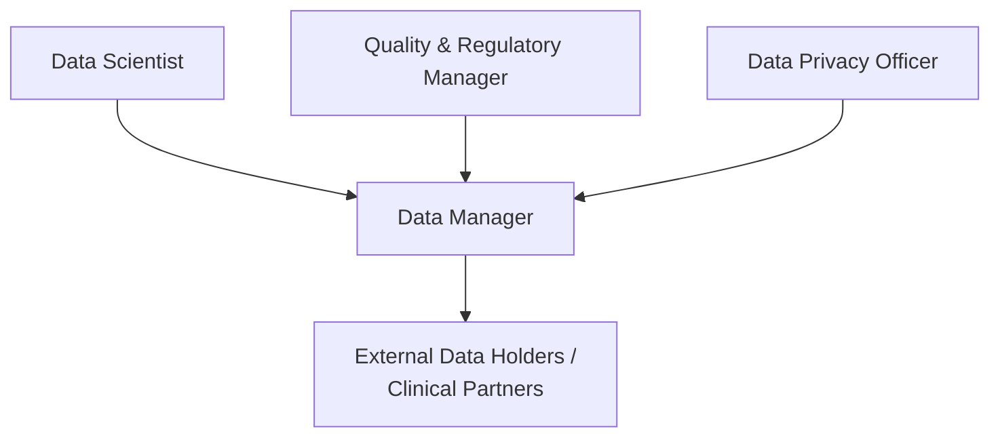
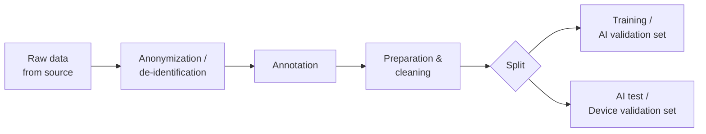
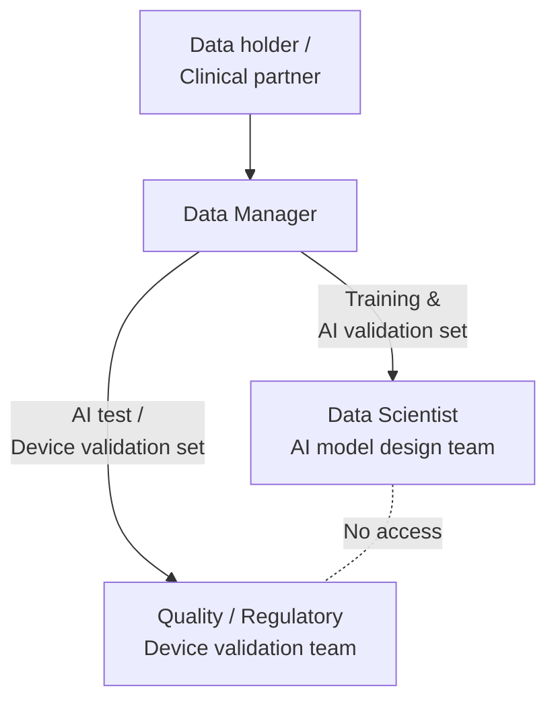

# Data Management Plan

## Table of Contents

> [!NOTE]
> Update this table of contents to reflect the sections in this document.
> In the MkDocs web view, the table of contents is generated automatically in the sidebar.
> This section is intended for printed or exported (PDF) versions of the document.
>
> Example:
> 1. IDENTIFICATION
> 2. RESPONSIBILITIES
> 3. TOOLS AND ENVIRONMENT
> 4. DATA REQUIREMENTS
> 5. DATA QUALITY MODEL
> 6. DATA ARCHITECTURE
> 7. DATA ACQUISITION
> 8. DATA ANNOTATION
> 9. DATA PREPARATION
> 10. DATA SPLITTING
> 11. DATA SEPARATION
> 12. DATA REVIEW
> 13. DATA PROVISIONING
> 14. DATA DECOMMISSIONING
> 15. DATA SECURITY AND PRIVACY
> 16. REGULATORY COMPLIANCE

## 1. IDENTIFICATION

| Field | Value |
|---|---|
| Document ID | <!-- TODO: e.g. PRJ-DMP-001 --> |
| Title | Data Management Plan |
| Version | <!-- TODO: e.g. 1.0 --> |
| Date | <!-- TODO: YYYY-MM-DD --> |
| Status | <!-- TODO: Draft / Under Review / Approved --> |

### 1.1 Document Overview

This Data Management Plan (DMP) defines the policies, procedures, and responsibilities for managing data throughout the AI/ML software development lifecycle. It covers data requirements, acquisition, annotation, preparation, splitting, quality control, security, and decommissioning for the <!-- TODO: project name --> project.

**Scope:** All datasets used for AI model design (training, AI validation) and device validation (AI test), from initial acquisition through to decommissioning.

**Intended audience:** Data scientists, data managers, quality and regulatory managers, data privacy officers, and clinical partners involved in the <!-- TODO: project name --> project.

--8<-- "snippets/glossary-and-references.md"

> [!TIP]
> **Standard references to add in §1.3.2**
> For a Data Management Plan, consider adding the following standards and guidance to the Standard References table:
>
> | Ref | Title | Edition |
> |---|---|---|
> | [ISO 5259-x] | Artificial intelligence — Data quality for analytics and machine learning (multi-part series) | (check current parts and editions) |
> | [ISO 8183] | Information technology — Artificial intelligence — Data lifecycle framework | 2023 |
> | [ISO 25024] | Systems and software engineering — Measurement of data quality | 2015 |
> | [ISO 25059] | Systems and software engineering — SQuaRE — Quality model for AI systems | 2023 |
> | [FDA-AI] | Artificial Intelligence-Enabled Device Software Functions: Lifecycle Management and Marketing Submission Recommendations | 2024 |
> | [EU-AI-Act] | Regulation (EU) 2024/1689 of the European Parliament and of the Council laying down harmonised rules on artificial intelligence (AI Act), in particular Article 10 on data and data governance | 2024 |

> [!TIP]
> **Additional definitions to add in §1.2.2**
> Add the following terms to the Glossary table:
>
> | Term | Definition |
> |---|---|
> | Data holder | A party with the legal control to authorize other parties to process data. |
>
> Consider also adding definitions from ISO 22989 (*Artificial intelligence — Concepts and terminology*) relevant to your project (e.g. training data, test data, annotation, bias).

> [!TIP]
> **Conventions to document in §1.4**
> The word *validation* carries different meanings in AI engineering and in medical device design. Document the following convention in §1.4 to avoid inconsistencies throughout this document:
>
> - **AI validation**: a step in AI design, performed after AI training and/or tuning, to evaluate and validate algorithmic choices (e.g. hyperparameter search, rule design, model selection).
> - **Device validation**: a step in medical device design. In US regulation, 21 CFR 820.3 defines *design validation* as establishing by objective evidence that device specifications conform with user needs and intended use(s).
>
> The word "validation" shall **never be used alone** in this document. One of the two qualified forms above shall always be used.

## 2. Responsibilities

> [!NOTE]
> Describe the organization of the team responsible for data management. Reference the Project Management Plan where the overall project team structure is already described, if applicable.

> [!NOTE]
> For small teams, a plain-text description is sufficient. For larger teams, use the table below. You may also document how adverse events are escalated — for example: *Adverse events or risks of adverse events related to data, detected anywhere in the organization, shall be immediately reported to the Data Privacy Officer.*

> [!NOTE]
> Replace the diagram above with the actual team structure for your project. Include names, roles, and reporting lines.

| Role | Responsibilities |
|---|---|
| Data Manager | Overall coordination of the data management process |
| Data Scientist | Data preparation, splitting, annotation, and provisioning |
| Quality & Regulatory Manager | Regulatory compliance of the data management process; liaison with ISO 14971 risk management |
| Data Privacy Officer | GDPR / privacy compliance; oversight of data acquisition and decommissioning |
| <!-- TODO --> | <!-- TODO --> |

## 3. Tools and Environment

> [!NOTE]
> List the tools used for each step of the data management process.

| Tool category | Tool name | Version |
|---|---|---|
| Annotation | <!-- TODO: e.g. CVAT, DAML, Label Studio --> | <!-- TODO --> |
| Data versioning and pipelines | <!-- TODO: e.g. DVC, MLflow --> | <!-- TODO --> |
| Model registry | <!-- TODO --> | <!-- TODO --> |
| Data storage | <!-- TODO: e.g. local server, S3, Azure Blob Storage --> | <!-- TODO --> |
| Integrity verification | <!-- TODO: e.g. SHA-256 checksum utilities --> | <!-- TODO --> |
| <!-- TODO --> | <!-- TODO --> | <!-- TODO --> |

## 4. Data Requirements

### 4.1. Link to Device Intended Use

> [!NOTE]
> Explain the need for data based on the device intended use or specific device functionalities. A State-of-the-Art (SOTA) analysis can provide consistency and rationale. This section also establishes the legitimate interest required under GDPR for processing health data.

> [!NOTE]
> Example: *The AI system requires ophthalmic imaging data because the device is intended to assist clinicians in diagnosing ophthalmic diseases, consistent with current clinical practice as documented in the SOTA analysis [SOTA-ref].*

> [!NOTE]
> Opthalmic diseases for diabetic patients is used for examples provided throughout this document

### 4.2. Data Specifications

> [!NOTE]
> Define what data are required for AI model design, based on the device intended use, target disease, and target population.

#### 4.2.1. Features

| Feature | Description | Format / unit |
|---|---|---|
| Retinal fundus image | Colour photograph of the posterior segment of the eye, capturing the optic disc and macula | PNG, 512 × 512 px, 8-bit RGB |
| <!-- TODO --> | <!-- TODO --> | <!-- TODO --> |

#### 4.2.2. Targets / Labels

| Target / label | Description | Annotation method |
|---|---|---|
| Diabetic retinopathy grade | Severity grade on the International Clinical DR Disease Severity Scale (0 — no DR; 1 — mild; 2 — moderate; 3 — severe; 4 — proliferative) | Manual grading by a certified ophthalmologist |
| <!-- TODO --> | <!-- TODO --> | <!-- TODO --> |

#### 4.2.3. Inclusion and Exclusion Criteria

| Criterion | Type | Description |
|---|---|---|
| Confirmed diagnosis of type 1 or type 2 diabetes mellitus | Inclusion | Subject has a recorded ICD-10 diagnosis code E10.x or E11.x in their medical record |
| <!-- TODO: e.g. Confirmed diagnosis of XXX --> | Inclusion | <!-- TODO --> |
| <!-- TODO: e.g. Allergy to substance XXX --> | Exclusion | <!-- TODO --> |

### 4.3. Bias Prevention

> [!NOTE]
> Identify potential sources of bias to control in order to ensure data representativeness.

> [!NOTE]
> Typical biases to assess: age distribution, sex/gender, ethnicity, acquisition site, imaging equipment model, clinical centre, disease severity, comorbidities.

| Potential bias | Description | Mitigation |
|---|---|---|
| Age bias | Dataset may over-represent patients aged 40–65 relative to the general diabetic population | Stratified sampling by age group (18–40 / 41–65 / 65+) to match target population distribution |
| <!-- TODO: e.g. Age bias --> | <!-- TODO --> | <!-- TODO: e.g. Stratified sampling by age group --> |
| <!-- TODO: e.g. Sex bias --> | <!-- TODO --> | <!-- TODO --> |
| <!-- TODO --> | <!-- TODO --> | <!-- TODO --> |

### 4.4. Anonymization

> [!NOTE]
> Describe whether anonymization or pseudonymization is required and to what standard (e.g. HIPAA Safe Harbor, GDPR Article 4(5)). Specify the techniques applied (e.g. DICOM de-identification per PS 3.15 Annex E, k-anonymity).

### 4.5. Traceability to Device / System Requirements

> [!NOTE]
> This section is optional. Include it when data requirements can be traced to specific device or system requirements that are more precise than the intended use statement.

| Data specification | Device / system requirement | Requirement ID |
|---|---|---|
| Retinal fundus images acquired at ≥ 45° field of view | The system shall process retinal fundus images acquired with standard fundus cameras at a minimum 45° field of view | SRS-042 |
| <!-- TODO --> | <!-- TODO --> | <!-- TODO --> |

## 5. Data Quality Model

> [!NOTE]
> Define the data quality model. Criteria should cover clinical, technical, statistical, and regulatory dimensions. Some criteria may also be mitigation actions arising from the ISO 14971 risk management process.

### 5.1. Clinical Criteria

| Criterion | Type | Threshold / description |
|---|---|---|
| Confirmed diagnosis of diabetes mellitus | Inclusion | ICD-10 code E10.x or E11.x recorded in the subject's medical record |
| <!-- TODO: e.g. Confirmed diagnosis of XXX --> | Inclusion | <!-- TODO --> |
| <!-- TODO: e.g. Patients with allergy to substance XXX --> | Exclusion | <!-- TODO --> |

### 5.2. Technical Criteria

| Criterion | Type | Threshold / description |
|---|---|---|
| Retinal fundus image resolution ≥ 1500 × 1500 px | Inclusion | Images below this resolution are too low-quality for reliable grading |
| <!-- TODO: e.g. ECG data with ≥ 3 channels --> | Inclusion | <!-- TODO --> |
| <!-- TODO: e.g. DICOM files with slice thickness > X mm --> | Exclusion | <!-- TODO --> |
| <!-- TODO: e.g. Data completion rate ≥ XX % --> | Quality threshold | <!-- TODO --> |

### 5.3. Representativeness Criteria

> [!NOTE]
> Define the statistical criteria demonstrating satisfactory coverage of the target disease and target population, and the absence of bias, including in relevant subgroups.

| Criterion | Subgroup | Method | Threshold |
|---|---|---|---|
| Sex distribution matches target population | Female / Male / Other | Chi-squared goodness-of-fit against general diabetic population reference (WHO data) | p > 0.05 |
| <!-- TODO: e.g. Age distribution balance --> | <!-- TODO: e.g. 18–40 / 41–65 / 65+ years --> | <!-- TODO: e.g. Chi-squared goodness-of-fit --> | <!-- TODO: e.g. p > 0.05 --> |
| <!-- TODO --> | <!-- TODO --> | <!-- TODO --> | <!-- TODO --> |

### 5.4. Regulatory Criteria

> [!NOTE]
> Add any criteria related to compliance with applicable regulations on health data and AI systems (e.g. EU AI Act Article 10, GDPR, 21 CFR Part 11).

## 6. Data Architecture

> [!NOTE]
> Describe the data architecture used for this project, or reference a dedicated data architecture document. The architecture may range from simple JSON files to complex DICOM databases. Describe the data model, storage format, directory structure, naming conventions, and file format standards.

> [!NOTE]
> Replace the diagram above with the actual data pipeline and storage architecture for your project.

| Layer | Format / technology | Location | Access control |
|---|---|---|---|
| Raw data | <!-- TODO: e.g. DICOM, CSV, JSON --> | <!-- TODO: e.g. clinical PACS, local server --> | <!-- TODO --> |
| Processed data | <!-- TODO --> | <!-- TODO --> | <!-- TODO --> |
| Annotated data | <!-- TODO --> | <!-- TODO --> | <!-- TODO --> |
| Training / AI validation set | <!-- TODO --> | <!-- TODO --> | <!-- TODO --> |
| AI test / device validation set | <!-- TODO --> | <!-- TODO --> | <!-- TODO --> |

## 7. Data Acquisition

> [!NOTE]
> Describe your data acquisition plan. Indicate the source type for each dataset, and reference relevant documents (e.g. clinical investigation protocol, PMCF registry plan, data transfer agreement).

> [!NOTE]
> Typical data source types:
>
> - Anonymized data from an internal collection
> - Off-the-shelf registry or public database (secondary use of clinical data)
> - Retrospective clinical study (secondary use of clinical data)
> - PMCF register from another manufacturer's device (secondary use of clinical data)
> - Prospective clinical investigation

| Dataset | Intended use | Source type | Reference document |
|---|---|---|---|
| <!-- TODO: Dataset A --> | Training / AI validation | <!-- TODO: e.g. Retrospective clinical study --> | <!-- TODO: ref --> |
| <!-- TODO: Dataset B --> | AI test / device validation | <!-- TODO: e.g. Prospective clinical investigation --> | <!-- TODO: ref --> |
| <!-- TODO --> | <!-- TODO --> | <!-- TODO --> | <!-- TODO --> |

> [!WARNING]
> The datasets used for training and AI validation, and those used for AI test and device validation, shall come from distinct acquisition processes. See also §11 (Data separation).

## 8. Data Annotation

> [!NOTE]
> Describe the annotation methods used to generate labels and metadata. Specify the qualification requirements for annotators. Define annotation quality metrics where applicable.

| Annotation type | Method | Personnel qualification required |
|---|---|---|
| Diabetic retinopathy severity grade | Manual grading using Label Studio web interface | Ophthalmologist with ≥ 3 years of clinical experience in diabetic retinopathy |
| <!-- TODO: e.g. Region of interest (ROI) --> | <!-- TODO: e.g. Manual annotation using CVAT --> | <!-- TODO: e.g. Radiologist with ≥ 3 years of experience --> |
| <!-- TODO: e.g. Clinical outcome category --> | <!-- TODO: e.g. Automated review of physician reports by an in-house LLM --> | <!-- TODO: e.g. Validated in-house LLM; output reviewed by qualified clinician --> |
| <!-- TODO --> | <!-- TODO --> | <!-- TODO --> |

> [!NOTE]
> Annotation operations shall be performed by, or reviewed by, qualified persons (e.g. persons with relevant clinical background). Document the qualification evidence in training records.

### 8.1. Annotation Quality Metrics

> [!NOTE]
> Define metrics to assess annotation quality, if applicable.

| Metric | Description | Acceptance threshold |
|---|---|---|
| Inter-rater agreement (Cohen's κ) | Pairwise κ computed between each pair of annotators on a 10 % random sample re-annotated independently | κ ≥ 0.80 |
| <!-- TODO: e.g. Inter-rater agreement (Cohen's κ) --> | <!-- TODO --> | <!-- TODO: e.g. κ ≥ 0.80 --> |
| <!-- TODO --> | <!-- TODO --> | <!-- TODO --> |

## 9. Data Preparation

> [!NOTE]
> Describe the data preparation techniques applied. List only those that apply to your project.

> [!NOTE]
> Common data preparation techniques: aggregation, sampling, augmentation, imputation, cleaning, outlier treatment, feature creation, encoding, feature selection, normalization / standardization. Not all techniques are required for every project.

| Technique | Description | Rationale |
|---|---|---|
| Normalization | Per-channel min-max scaling of pixel values to [0, 1] | Required by the model architecture; improves training convergence |
| <!-- TODO: e.g. Normalization --> | <!-- TODO: e.g. Min-max scaling to [0, 1] --> | <!-- TODO: e.g. Required by the model architecture --> |
| <!-- TODO: e.g. Data augmentation --> | <!-- TODO: e.g. Random horizontal flip, rotation ±15° --> | <!-- TODO: e.g. To increase training set diversity and reduce overfitting --> |
| <!-- TODO --> | <!-- TODO --> | <!-- TODO --> |

## 10. Data Splitting

> [!NOTE]
> Define the ratios used to split data into training, AI validation, and AI test subsets. Justify the ratios chosen, especially if non-standard splitting was performed or unexpected events affected the split.

| Dataset | Ratio | Record count (expected) |
|---|---|---|
| Training | <!-- TODO: e.g. 70 % --> | <!-- TODO --> |
| AI validation | <!-- TODO: e.g. 15 % --> | <!-- TODO --> |
| AI test / device validation | <!-- TODO: e.g. 15 % --> | <!-- TODO --> |

> [!NOTE]
> Ratios are indicative and shall be justified based on dataset size and statistical power requirements. Stratified splitting is recommended to preserve class balance and subgroup representation across subsets.

## 11. Data Separation

> [!NOTE]
> Describe the organizational measures put in place to ensure that the AI test / device validation dataset is sequestered from the AI model design team prior to final evaluation.

> [!WARNING]
> **Data separation — regulatory requirement**
> The FDA uses the term *sequestration* to refer to this requirement. The AI test and device validation datasets shall not be accessible to the AI model design team (especially the data scientists performing training and AI validation) prior to the final evaluation.

| Measure | Description | Responsible |
|---|---|---|
| Separate storage locations | AI test / device validation set stored on an access-controlled network share; data scientists' accounts have no mount rights to that share | Data Manager |
| <!-- TODO: e.g. Separate storage locations --> | <!-- TODO: e.g. AI test set stored on an access-controlled server, not accessible to data scientists --> | <!-- TODO: Data Manager --> |
| <!-- TODO: e.g. Access rights management --> | <!-- TODO: e.g. Data scientists' accounts excluded from the AI test set directory --> | <!-- TODO: IT / Data Manager --> |
| <!-- TODO --> | <!-- TODO --> | <!-- TODO --> |

## 12. Data Review

> [!NOTE]
> Plan at least one formal review of the training / AI validation dataset and one formal review of the AI test / device validation dataset, prior to provisioning. Define the review criteria and expected outputs.

> [!NOTE]
> A data review shall verify that:
>
> 1. Data acquisition and preparation have been performed as planned.
> 2. Datasets meet the data quality requirements (§5), including inclusion and exclusion criteria.
> 3. Datasets meet applicable regulatory requirements.
> 4. Any limitations or deviations do not adversely affect device safety, performance, or regulatory compliance.

| Review ID | Dataset | Trigger | Criteria reference | Responsible | Output |
|---|---|---|---|---|---|
| DR-1 | Training / AI validation dataset | Before provisioning to the AI model design team | §4.2, §5 | <!-- TODO --> | Data Review Report DR-1 |
| DR-2 | AI test / device validation dataset | Before provisioning to the device validation team | §4.2, §5 | <!-- TODO --> | Data Review Report DR-2 |
| <!-- TODO --> | <!-- TODO --> | <!-- TODO --> | <!-- TODO --> | <!-- TODO --> | <!-- TODO --> |

## 13. Data Provisioning

> [!NOTE]
> Describe how datasets are formally delivered to the AI model design team and / or the device validation team.

Each provisioned dataset shall be:

- **Identified** with a unique dataset identifier and descriptive name.
- **Versioned** (e.g. using DVC or an equivalent data versioning tool).
- **Placed under configuration management** consistently with the Software Configuration Management Plan.
- **Accompanied by a descriptive statistics summary** (record count, feature distributions, class balance, subgroup counts, etc.).
- **Optionally: provided with integrity metadata** (e.g. SHA-256 checksums for each file and/or the dataset archive).

> [!NOTE]
> Data quality issues detected when applying the dataset to the model (e.g. unexpected label distribution, missing values) shall be logged and fed back into the data requirements, acquisition, and preparation steps as applicable.

| Dataset ID | Version | Provisioning date | Statistics report | Checksum | Recipient |
|---|---|---|---|---|---|
| DS-TRAIN-01 | 1.0 | <!-- TODO: YYYY-MM-DD --> | Stats-DS-TRAIN-01-v1.0 | SHA-256: <!-- TODO --> | AI model design team |
| <!-- TODO --> | <!-- TODO --> | <!-- TODO --> | <!-- TODO: ref --> | <!-- TODO --> | <!-- TODO --> |

## 14. Data Decommissioning

> [!NOTE]
> Document how and when data will be decommissioned.

Data decommissioning consists of one or more of the following operations:

- Secure destruction of data,
- Archiving for a defined retention period, as required by applicable regulations,
- Transfer to another department, entity, or organization,
- Return of data to the data holder.

### 14.1. Triggers for Decommissioning

Data decommissioning is triggered when:

1. A dataset is deemed no longer useful for AI model design, or the AI model design project is discontinued without any device being placed on the market.
2. The regulatory retention period for device design data has elapsed, for devices that have been placed on the market.

> [!NOTE]
> **Retention period**
> The retention period is defined in accordance with applicable regulations (e.g. EU MDR Article 10(8): minimum 10 years after the last device was placed on the market; 15 years for implantable devices).
>
> **Retention period for this device: <!-- TODO: e.g. 10 years from the date of last manufacture -->**

### 14.2. Decommissioning Plan

> [!NOTE]
The decommissionning plan may not be available at the beginning of a design project. It may be left blank or partially documented. Thus, an update of the data management plan shalled be planned to document the missing plan

| Dataset | Trigger | Decommissioning method | Responsible | Target date |
|---|---|---|---|---|
| DS-TRAIN-01 | End of 10-year retention period from date of last manufacture | Secure deletion per NIST SP 800-88 Rev. 1 (Purge method) | Data Manager | <!-- TODO: YYYY-MM-DD --> |
| <!-- TODO --> | <!-- TODO: e.g. End of retention period --> | <!-- TODO: e.g. Secure deletion per NIST SP 800-88 --> | <!-- TODO --> | <!-- TODO --> |
| <!-- TODO --> | <!-- TODO --> | <!-- TODO --> | <!-- TODO --> | <!-- TODO --> |

## 15. Data Security and Privacy

> [!NOTE]
> Document how data security and privacy are ensured. Reference applicable documents.

> [!NOTE]
> You may reference documents such as:
>
> - Data Protection Impact Assessment (DPIA / PIA) — required by GDPR Article 35 for high-risk processing,
> - Documents from an Information Security Management System (ISMS), e.g. ISO 27001,
> - QMS-level or project-level security provisions.

| Requirement | Measure | Reference document |
|---|---|---|
| Data at rest encryption | <!-- TODO: e.g. AES-256 on the storage server --> | <!-- TODO --> |
| Data in transit encryption | <!-- TODO: e.g. TLS 1.3 for all transfers --> | <!-- TODO --> |
| Access control | <!-- TODO: e.g. Role-based access control (RBAC) with MFA --> | <!-- TODO --> |
| Audit logging | <!-- TODO: e.g. All data access and modifications are logged and retained --> | <!-- TODO --> |
| Anonymization / pseudonymization | See §4.4 | — |
| Data Protection Impact Assessment | <!-- TODO: DPIA required? Performed? --> | <!-- TODO: DPIA ref --> |
| <!-- TODO --> | <!-- TODO --> | <!-- TODO --> |

## 16. Regulatory Compliance

> [!NOTE]
> Document how compliance with applicable data regulations is ensured for each regulation that applies to your project and target market.

> [!NOTE]
> Address at minimum:
>
> - Local regulations on clinical investigations or secondary use of clinical data,
> - Data security and privacy regulations (may overlap with §15),
> - Personal data regulations applicable to your target market.

| Regulation | Applicability | Compliance measure | Reference document |
|---|---|---|---|
| GDPR (Regulation (EU) 2016/679) | Personal data of EU data subjects | <!-- TODO: e.g. Lawful basis established per Art. 6 & 9; DPIA performed per Art. 35; data minimisation applied --> | <!-- TODO: DPIA ref --> |
| EU AI Act (Regulation (EU) 2024/1689) — Article 10 | High-risk AI systems placed on the EU market | <!-- TODO: e.g. Data governance practices documented; training, AI validation, and AI test data quality criteria defined and verified --> | <!-- TODO --> |
| HIPAA (45 CFR Parts 160, 162, 164) | Protected Health Information (PHI) processed in the US | <!-- TODO: e.g. De-identification performed per Safe Harbor or Expert Determination method --> | <!-- TODO --> |
| <!-- TODO: local clinical investigation regulation --> | <!-- TODO --> | <!-- TODO --> | <!-- TODO --> |
| <!-- TODO --> | <!-- TODO --> | <!-- TODO --> | <!-- TODO --> |
