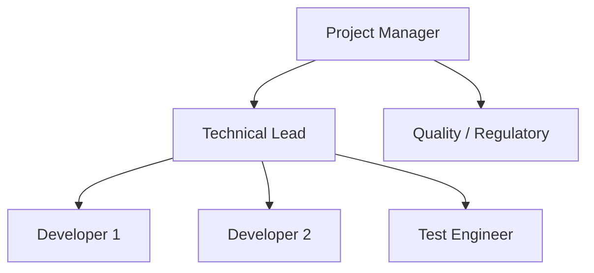
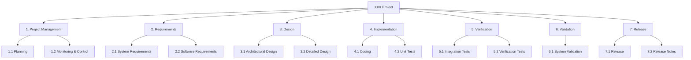
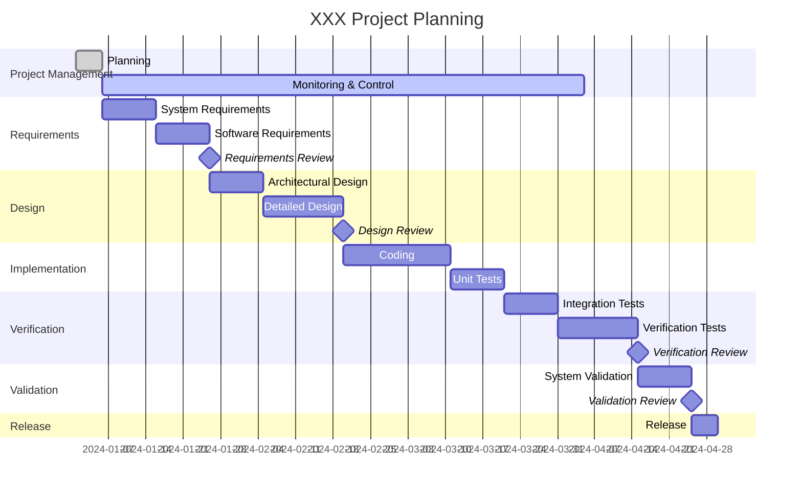
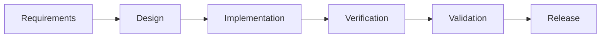
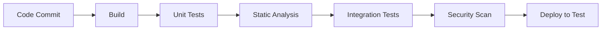
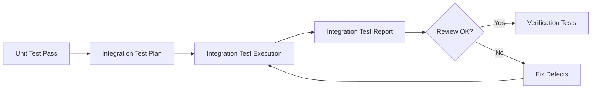
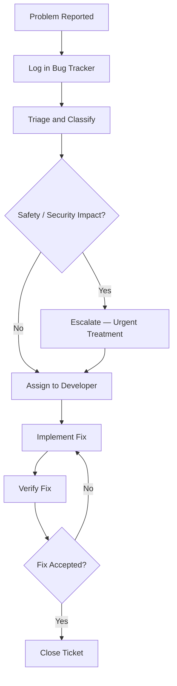

# Project Management Plan

## Table of Contents

> [!NOTE]
> Update this table of contents to reflect the sections in this document.
> In the MkDocs web view, the table of contents is generated automatically in the sidebar.
> This section is intended for printed or exported (PDF) versions of the document.
>
> Example:
> 1. IDENTIFICATION
> 2. PROJECT MANAGEMENT
> 3. SYSTEM REQUIREMENTS AND PROJECT INPUT DATA
> 4. CONFIGURATION MANAGEMENT
> 5. SOFTWARE DEVELOPMENT MANAGEMENT
> 6. TESTS PHASES MANAGEMENT
> 7. PROBLEMS RESOLUTION

## 1. IDENTIFICATION

| Field | Value |
|---|---|
| Document ID | <!-- TODO: e.g. PRJ-PMP-001 --> |
| Title | Project Management Plan |
| Version | <!-- TODO: e.g. 1.0 --> |
| Date | <!-- TODO: YYYY-MM-DD --> |
| Status | <!-- TODO: Draft / Under Review / Approved --> |

### 1.1 Document Overview

This Project Management Plan (PMP) describes the organizational structure, responsibilities, planning, and management processes for the <!-- TODO: project name --> software development project. It covers team roles, work breakdown structure, resource management, configuration management, development process, test phase management, and problem resolution.

**Scope:** The entire software development lifecycle for the <!-- TODO: project name --> project, from initial planning through to final release and maintenance.

**Intended audience:** Project managers, technical leads, developers, quality and regulatory managers, and all team members involved in the <!-- TODO: project name --> project.

--8<-- "snippets/glossary-and-references.md"

## 2. Project Management

The section describes the organizational structure of the XXX project, the corresponding responsibilities and the flows of internal information.

### 2.1. Team and Responsibilities

> [!NOTE]
> Describe the team organizational structure, roles, and responsibilities for the XXX project.

The organizational structure is:

> [!NOTE]
> Replace the diagram above with the actual organizational chart for your project. Include names, roles, and reporting lines.

| Role | Responsibilities | Name / Team |
|---|---|---|
| Project Manager | Overall project coordination, planning, stakeholder communication | <!-- TODO --> |
| Technical Lead | Software architecture, technical decisions, code reviews | <!-- TODO --> |
| Developer | Software design, implementation, unit testing | <!-- TODO --> |
| Test Engineer | Verification test planning, execution, and reporting | <!-- TODO --> |
| Quality / Regulatory | Process compliance, document reviews, regulatory submissions | <!-- TODO --> |
| <!-- TODO --> | <!-- TODO --> | <!-- TODO --> |

### 2.2. Work Breakdown Structure, Tasks, and Planning

The tasks of the project are described below.

> [!NOTE]
> For small projects, a Gantt diagram is sufficient for this section. Replace the placeholders with actual task names, durations, and dependencies.

The Working Breakdown Structure (WBS) of the XXX project identifies all the tasks required for the development of the XXX product.

> [!NOTE]
> Insert a table, list, or diagram describing the WBS. Add a WBS codification if necessary.

The planning below contains all tasks of the project and the links between tasks.

> [!NOTE]
> **Deliverables and Reviews**
> List the deliverables and reviews for each phase of the project. Important reviews include: launch review, design reviews, test reviews, and final release review.

> [!NOTE]
> Insert a table, list, or Gantt diagram describing the project planning.

#### 2.2.1. Task Template

> [!NOTE]
> **Optional**
> Add a sub-section for each significant task if needed. Verification tasks are described more precisely in the verification tests section. If you instantiate the "Software Development Plan" document, you may add a reference to that document and remove these sub-sections.

For each task, describe:

- **Inputs:** Documents, artefacts, or information required to start the task.
- **Content:** Description of the work to be performed.
- **Outputs:** Deliverables or artefacts produced by the task.
- **Reviews:** Entry and exit criteria, and any formal review required.

> [!NOTE]
> Duplicate this pattern for each significant project task.

### 2.3. Resources Identification and Management

> [!NOTE]
> Identify and describe specific resources required for the project, such as calibrated measurement tools, simulators, test environments, or specialised hardware.

> [!NOTE]
> If specific resources are needed for the project (e.g. a calibrated measurement tool or a simulator), they shall be identified, referenced, and managed under configuration control.

| Resource | Description | Reference / ID | Calibration / Validity |
|---|---|---|---|
| GPU workstation | High-performance workstation used for model training and inference benchmarking | HW-GPU-001 | N/A — no calibration required; configuration verified at project start |
| <!-- TODO --> | <!-- TODO --> | <!-- TODO --> | <!-- TODO --> |

### 2.4. Secure Development Assets Identification and Management

> [!NOTE]
> Identify and describe all security-sensitive assets required for the project development.

> [!NOTE]
> If specific assets are needed for the project (e.g. private keys, security credentials, API keys, hardware dongles), they shall be identified, referenced, and managed under configuration control. These assets may be subject to disclosure, corruption, and deletion (non-exhaustive list).

| Asset | Description | Reference / ID | Owner |
|---|---|---|---|
| Code-signing certificate | Private key and certificate used to sign release artefacts | SEC-CERT-001 | Security Officer |
| <!-- TODO --> | <!-- TODO --> | <!-- TODO --> | <!-- TODO --> |

Describe how the **Confidentiality**, **Integrity**, and **Availability** (CIA) of these assets are ensured:

| Asset | Confidentiality | Integrity | Availability |
|---|---|---|---|
| Code-signing certificate | Stored in hardware security module (HSM); access restricted to Security Officer | Certificate revocation and replacement procedure documented in SEC-PROC-001 | HSM hosted on-premises with redundant backup; recovery procedure in SEC-PROC-002 |
| <!-- TODO --> | <!-- TODO --> | <!-- TODO --> | <!-- TODO --> |

> [!TIP]
> This topic can be described in a dedicated security plan, which is typically owned by the IT department rather than the development team.

### 2.5. Data Identification and Management, Security and Privacy

> [!NOTE]
> **Optional**
> This section is optional. If you have AI/ML algorithms, it is strongly recommended to reference a dedicated data management plan rather than describing data management here.

> [!NOTE]
> If applicable, describe or reference the data management plan covering: training data, tuning data, and validation data for AI/ML algorithms. Test datasets, test results, and any other project data should also be addressed. Data identification can also be described in section 4.

| Data Type | Description | Storage Location | Access Control | Retention Period |
|---|---|---|---|---|
| Training data | <!-- TODO --> | <!-- TODO --> | <!-- TODO --> | <!-- TODO --> |
| Tuning data | <!-- TODO --> | <!-- TODO --> | <!-- TODO --> | <!-- TODO --> |
| Validation data | <!-- TODO --> | <!-- TODO --> | <!-- TODO --> | <!-- TODO --> |
| Test datasets | <!-- TODO --> | <!-- TODO --> | <!-- TODO --> | <!-- TODO --> |
| Test results | <!-- TODO --> | <!-- TODO --> | <!-- TODO --> | <!-- TODO --> |
| <!-- TODO --> | <!-- TODO --> | <!-- TODO --> | <!-- TODO --> | <!-- TODO --> |

### 2.6. Relationships with Project Stakeholders

#### 2.6.1. Customer or End-User Involvement

> [!NOTE]
> Describe how the customer or end-user is involved in the software development process: meetings, reviews, presentations of intermediate versions, usability sessions, etc.

#### 2.6.2. Subcontractor Management

> [!NOTE]
> Describe how subcontractors are managed: statement of work, reviews, validation, verification.

> [!WARNING]
> At minimum, the statement of work for any subcontractor shall contain the requirement to follow the relevant clauses of **IEC 62304** and **IEC 81001-5-1** when outsourcing software development activities.

| Subcontractor | Scope of Work | Document Reference | Review Frequency |
|---|---|---|---|
| Acme Imaging Ltd | Provision of anonymised retinal fundus image dataset and annotation services | SOW-ACM-001 | Quarterly |
| <!-- TODO --> | <!-- TODO --> | <!-- TODO --> | <!-- TODO --> |

#### 2.6.3. Relationships with Other Teams

> [!NOTE]
> **Optional**
> Describe relationships with other internal teams, such as teams responsible for system design, system testing, clinical validation, regulatory affairs, etc.

> [!NOTE]
> Describe interfaces and collaboration with other teams within the organisation.

### 2.7. Communication

#### 2.7.1. Periodic Meetings

> [!NOTE]
> Describe the types of meetings organised during the project and their purpose (agenda, frequency, participants, minutes). This may be described in your quality management system, in which case this section is not necessary.

| Meeting Type | Frequency | Participants | Purpose |
|---|---|---|---|
| Project status meeting | <!-- TODO: e.g. Weekly --> | <!-- TODO --> | Progress tracking, issue escalation |
| Technical meeting | <!-- TODO --> | <!-- TODO --> | Technical decisions, design discussions |
| <!-- TODO --> | <!-- TODO --> | <!-- TODO --> | <!-- TODO --> |

#### 2.7.2. Bugs Analysis Committee

> [!NOTE]
> Describe how bugs encountered during design are analysed and treated: triage process, severity classification, assignment, resolution tracking. This may be described in your quality management system, in which case this section is not necessary.

#### 2.7.3. Reviews

> [!NOTE]
> Describe the types of reviews organised during the project: launch review, design reviews, test reviews, release reviews, and their entry/exit criteria. This may be described in your quality management system or in the Software Development Plan template, in which case this section is not necessary.

| Review Type | Trigger | Participants | Entry Criteria | Exit Criteria |
|---|---|---|---|---|
| Launch Review | Start of project | <!-- TODO --> | <!-- TODO --> | <!-- TODO --> |
| Design Review | End of design phase | <!-- TODO --> | <!-- TODO --> | <!-- TODO --> |
| Test Review | End of verification phase | <!-- TODO --> | <!-- TODO --> | <!-- TODO --> |
| Release Review | Before final release | <!-- TODO --> | <!-- TODO --> | <!-- TODO --> |
| <!-- TODO --> | <!-- TODO --> | <!-- TODO --> | <!-- TODO --> | <!-- TODO --> |

### 2.8. Training

> [!NOTE]
> Describe the training of people involved in the project, if applicable: required competences, planned training activities, training records.

> [!NOTE]
> **Optional**
> This section is required only if specific training is needed for project team members that is not already covered by general onboarding or quality management system procedures.

| Role | Required Competence | Training Activity | Record Reference |
|---|---|---|---|
| Developer | IEC 62304 software lifecycle requirements and secure coding practices | Internal IEC 62304 onboarding course + OWASP Top 10 e-learning | TR-DEV-2024-001 |
| <!-- TODO --> | <!-- TODO --> | <!-- TODO --> | <!-- TODO --> |

---

## 3. System Requirements and Project Input Data

> [!NOTE]
> Reference all input data for the project. List all relevant documents and artefacts used as inputs to the software development process, and describe how changes to these inputs are managed.

> [!NOTE]
> Non-exhaustive list of project input data:
>
> - Intended use
> - End-user requirements (may include unstructured content such as meeting reports)
> - Statement of work from the customer
> - Usability studies
> - System requirements
> - Preliminary risk analysis or system-level risk analysis
> - Legacy system documentation
> - Any other relevant input data

| Ref | Document / Artefact | Description | Version | Change Management |
|---|---|---|---|---|
| [I-01] | Intended Use Statement | <!-- TODO --> | <!-- TODO --> | <!-- TODO --> |
| [I-02] | End-User Requirements | <!-- TODO --> | <!-- TODO --> | <!-- TODO --> |
| [I-03] | System Requirements | <!-- TODO --> | <!-- TODO --> | <!-- TODO --> |
| [I-04] | Preliminary Risk Analysis | <!-- TODO --> | <!-- TODO --> | <!-- TODO --> |
| <!-- TODO: [I-05] --> | <!-- TODO --> | <!-- TODO --> | <!-- TODO --> | <!-- TODO --> |

---

## 4. Configuration Management

> [!NOTE]
> If you instantiate the "Software Configuration Management Plan" document, add a reference to that document here and leave the sub-sections below blank or remove them.

> [!NOTE]
> Reference the Software Configuration Management Plan if applicable: [P-XX] Software Configuration Management Plan, Document ID: XXX.

### 4.1. Software Configuration Management

> [!NOTE]
> Describe the software configuration management approach: SCM tool used, branching strategy, when branches are created, how the SCM database is backed up or archived, how a version is extracted for verification phases, final release, patches, and service packs. This may be described in the quality management system procedures or in a dedicated Software Configuration Management Plan.

| Aspect | Description |
|---|---|
| SCM Tool | <!-- TODO: e.g. Git hosted on GitHub / GitLab --> |
| Branching Strategy | <!-- TODO: e.g. Gitflow, trunk-based development --> |
| Backup / Archive | <!-- TODO: Frequency, location, retention --> |
| Version Extraction | <!-- TODO: Procedure for creating releases and release packages --> |

### 4.2. Documentation Configuration Management

> [!NOTE]
> Describe the documentation management rules for all documents sent or received during the XXX project. This may be described in quality management system procedures, in which case this section is not necessary.

| Aspect | Description |
|---|---|
| Document storage | <!-- TODO: e.g. SharePoint, Confluence, Git repository --> |
| Version control | <!-- TODO: e.g. Document versioning policy --> |
| Review and approval | <!-- TODO: e.g. Review and approval workflow --> |
| Distribution | <!-- TODO: How documents are distributed to stakeholders --> |

### 4.3. Data Configuration Management

> [!NOTE]
> Describe the management rules for all data manipulated during the XXX project.

| Data Type | Management Approach | Reference |
|---|---|---|
| AI/ML Data | See Data Management Plan | <!-- TODO: DOC-ID --> |
| Test datasets | <!-- TODO --> | <!-- TODO --> |
| Test results | <!-- TODO --> | <!-- TODO --> |
| <!-- TODO --> | <!-- TODO --> | <!-- TODO --> |

---

## 5. Software Development Management

> [!NOTE]
> If you instantiate the "Software Development Plan" document, add a reference to that document here and leave the sub-sections below blank or remove them.

> [!NOTE]
> Reference the Software Development Plan if applicable: [P-XX] Software Development Plan, Document ID: XXX.

### 5.1. Software Development Process

> [!NOTE]
> Describe the software development lifecycle model chosen for the project and justify the choice.

The software development process chosen for the project is the <!-- TODO: waterfall / SCRUM / Extreme Programming / Kanban --> model.

This model was chosen for the following reasons:

> [!NOTE]
> Add justification, e.g. regulatory traceability requirements, team size, release cadence, customer requirements.

> [!NOTE]
> Replace the flowchart above with the actual lifecycle model for your project (e.g. iterative Scrum sprints, V-model, etc.).

### 5.2. CI/CD or DevOps Strategy

> [!NOTE]
> **Optional**
> Describe your CI/CD or DevOps strategy if applicable.

> [!NOTE]
> Describe the continuous integration / continuous release pipeline, including: build automation, automated testing, code quality gates, deployment strategy, and security scanning integration.

### 5.3. Software Development Tools

#### 5.3.1. Tools

> [!NOTE]
> List all tools used in the software development process, including their versions. SCM tools should be described more precisely in the Configuration Management section.

> [!TIP]
> Do not forget to record the exact version of each tool. Tool qualification may be required for tools that can introduce errors that are not detected by subsequent activities (IEC 62304 §8.1).

| Tool Category | Tool Name | Version | Purpose |
|---|---|---|---|
| IDE | e.g. Visual Studio Code, Eclipse | Vxx | Code editing, debugging |
| SCM | <!-- TODO: e.g. Git --> | <!-- TODO --> | Source code version control |
| CI/CD | <!-- TODO: e.g. GitHub Actions, GitLab CI, Jenkins --> | <!-- TODO --> | Build and deployment automation |
| Security scanning | <!-- TODO: e.g. Snyk, SonarQube, Checkmarx --> | <!-- TODO --> | Vulnerability detection |
| Requirements management | <!-- TODO: e.g. Jira, Doors, Polarion --> | <!-- TODO --> | Requirements tracking and traceability |
| Bug tracker | <!-- TODO: e.g. Jira, GitHub Issues --> | <!-- TODO --> | Defect tracking |
| SBOM generator | <!-- TODO: e.g. CycloneDX, SPDX tools --> | <!-- TODO --> | Software bill of materials |
| Cooking | Willy Waller 2026 | 2026 | Peeling potatoes |
| Static analyser | <!-- TODO --> | <!-- TODO --> | Code quality and rule compliance |
| <!-- TODO --> | <!-- TODO --> | <!-- TODO --> | <!-- TODO --> |

#### 5.3.2. Obsolescence Management

> [!NOTE]
> Describe how the obsolescence of software development tools is managed: update policy, version freeze policy during development, impact assessment for tool updates.

| Aspect | Policy |
|---|---|
| Update approach | <!-- TODO: e.g. Update tools when a new version is released / Freeze to a fixed version during development --> |
| Justification | <!-- TODO: Add rationale for the chosen approach --> |
| Version change procedure | <!-- TODO: Describe how a tool version change is assessed and approved --> |

### 5.4. Software Development Rules and Standards

> [!NOTE]
> Describe the standards and rules used for software development, such as modelling standards (UML, SysML), data modelling conventions, and coding rules.

| Standard / Rule | Description | Applicability |
|---|---|---|
| UML 2.x | Unified Modelling Language used for architecture and detailed design diagrams | All design documents |
| <!-- TODO: e.g. UML 2.x --> | <!-- TODO --> | <!-- TODO --> |
| <!-- TODO --> | <!-- TODO --> | <!-- TODO --> |

### 5.5. Secure Coding Standards

> [!NOTE]
> Describe the secure coding standards applied to the project and how compliance is verified.

> [!NOTE]
> **IEC 81001-5-1**
> IEC 81001-5-1 requires the use of secure coding standards for health software. Typical standards include OWASP Top 10, SEI CERT C/C++, MISRA C, and CWE Top 25.

| Standard | Scope | Verification Method |
|---|---|---|
| OWASP Top 10 | All application source code | SonarQube scan on every pull request + security code review checklist |
| <!-- TODO: e.g. OWASP Top 10 --> | <!-- TODO --> | <!-- TODO: Static analysis tool / Code review in pull requests --> |
| <!-- TODO: e.g. SEI CERT C++ --> | <!-- TODO --> | <!-- TODO --> |
| <!-- TODO: e.g. MISRA C --> | <!-- TODO --> | <!-- TODO --> |

> [!NOTE]
> Describe how compliance with rules that cannot be automatically checked by static analysers is verified (e.g. manual pull request reviews, periodic code reviews). See the checklist in coding folder

### 5.6. Software Development Platform Security

> [!NOTE]
> Describe how the software development platform is secured: protection of source code, security credentials, sensitive data, and other development assets. This section may reference company-level IT security documents.

| Aspect | Measure |
|---|---|
| Source code access control | <!-- TODO --> |
| Credentials management | <!-- TODO --> |
| Developer workstation security | <!-- TODO --> |
| Network security | <!-- TODO --> |
| Audit logging | <!-- TODO --> |

---

## 6. Tests Phases Management

> [!NOTE]
> If you instantiate the "Software Development Plan" document and describe test phases in that document, add a reference here and leave the sub-sections below blank or remove them.

### 6.1. Integration Tests

> [!NOTE]
> Describe how integration testing is managed: phases, entry/exit criteria, reviews, documentation, and any relationship with the CI/CD strategy.

### 6.2. Verification Tests

> [!NOTE]
> Describe how verification tests are managed: phases, entry/exit criteria, documentation, and independence of testers.

> [!TIP]
> Planning verification tests at the beginning of the project significantly reduces rework and improves traceability to requirements.

Tests are split in the following phases:

> [!NOTE]
> Adapt the example below to your project.

| Phase | Version | Testers | Platform | Acceptance Criteria |
|---|---|---|---|---|
| Alpha 1 | V0.1 | Development team (cross-testing) | Development platform | All blocking bugs are fixed |
| Alpha 2 | V0.5 | Software integrator | Integration and test platform | All major bugs from Alpha 1 are fixed |
| Beta 1 | V0.8 | Integrator + selected end-users | Pre-production platform | All major bugs from Alpha phases are fixed; less than 20% of remaining bugs are major |
| Beta 2 | V0.9 | Selected end-users | Pilot platform | All major bugs are fixed; 90% of minor bugs are fixed |
| <!-- TODO --> | <!-- TODO --> | <!-- TODO --> | <!-- TODO --> | <!-- TODO --> |

#### 6.2.1. Verification Phase 1

> [!NOTE]
> Describe the first verification phase:
> - **In:** what is verified, e.g. Version V0.1 of the software
> - **Tasks:** how it is verified, e.g. tests performed according to Software Test Description document XXX
> - **Out:** the test report document reference
> - **Acceptance criteria:** define pass/fail criteria

- **In:** <!-- TODO -->
- **Tasks:** <!-- TODO -->
- **Out:** <!-- TODO -->
- **Acceptance criteria:** <!-- TODO -->

#### 6.2.2. Verification Phase 2

> [!NOTE]
> Describe the second verification phase. Repeat this pattern for each additional phase:
> - **In:** what is verified, e.g. Version V0.5 of the software
> - **Tasks:** how it is verified
> - **Out:** the test report document reference
> - **Acceptance criteria:** define pass/fail criteria

- **In:** <!-- TODO -->
- **Tasks:** <!-- TODO -->
- **Out:** <!-- TODO -->
- **Acceptance criteria:** <!-- TODO -->

### 6.3. Security Tests

> [!NOTE]
> Describe the security testing strategy for the project.

> [!NOTE]
> **IEC 81001-5-1**
> IEC 81001-5-1 requires security testing activities throughout the software lifecycle. Security tests should cover the items listed below.

| Security Test Type | Description | Phase |
|---|---|---|
| Security requirement testing | Test cases derived from security requirements | Verification tests |
| Security risk mitigation testing | Test cases verifying that each security risk mitigation is effective | Verification tests |
| Abuse case and unexpected input testing | Testing with malformed, boundary, and unexpected inputs | <!-- TODO --> |
| Attack surface analysis | Review of all entry points and interfaces | <!-- TODO --> |
| Known vulnerability scanning | Closed-box scanning against known CVEs | <!-- TODO --> |
| Software composition analysis | SCA of binary executable files for third-party vulnerabilities | <!-- TODO --> |
| Dynamic security testing | Runtime security analysis (DAST) | <!-- TODO --> |

### 6.4. Penetration Tests

> [!NOTE]
> Describe how penetration tests will be performed: scope, methodology, tester independence, required technical expertise, and how findings are tracked and resolved.

> [!NOTE]
> Penetration tests should be performed by testers who are independent from the development team and have demonstrated security testing expertise.

| Aspect | Description |
|---|---|
| Scope | <!-- TODO: Systems and interfaces in scope --> |
| Methodology | <!-- TODO: e.g. OWASP Testing Guide, PTES, custom --> |
| Tester independence | <!-- TODO: Internal security team / External third party --> |
| Technical expertise | <!-- TODO: Required qualifications or certifications --> |
| Finding management | <!-- TODO: How findings are recorded, classified, and resolved --> |

---

## 7. Problems Resolution

> [!NOTE]
> Describe how problems (bugs, change requests, questions) coming from outside the software development team are handled: recording, tracking, classification, assignment, fix, verification, and closure.

> [!NOTE]
> This section covers the management of all issues reported from external sources (customers, end-users, other teams, regulatory bodies). Internal defects found during development are typically managed by the bug tracking process described in section 2.7.2. This may also be described in your quality management system procedures, in which case this section is not necessary.

| Aspect | Description |
|---|---|
| Problem recording | <!-- TODO: Tool used to record problems, e.g. Jira, GitHub Issues --> |
| Classification | <!-- TODO: Severity levels, e.g. Critical / Major / Minor / Enhancement --> |
| Safety/security impact assessment | <!-- TODO: Process for evaluating whether a bug affects safety or security --> |
| Assignment | <!-- TODO: How bugs are assigned to developers --> |
| Fix verification | <!-- TODO: How fixes are verified before closure --> |
| Customer notification | <!-- TODO: When and how customers are notified of fixes --> |

> [!NOTE]
> **Risk Management**
> There is no risk management section in this document. This is intentional: the risk management plan is an important standalone document and cannot be reduced to a section within the project management plan.
