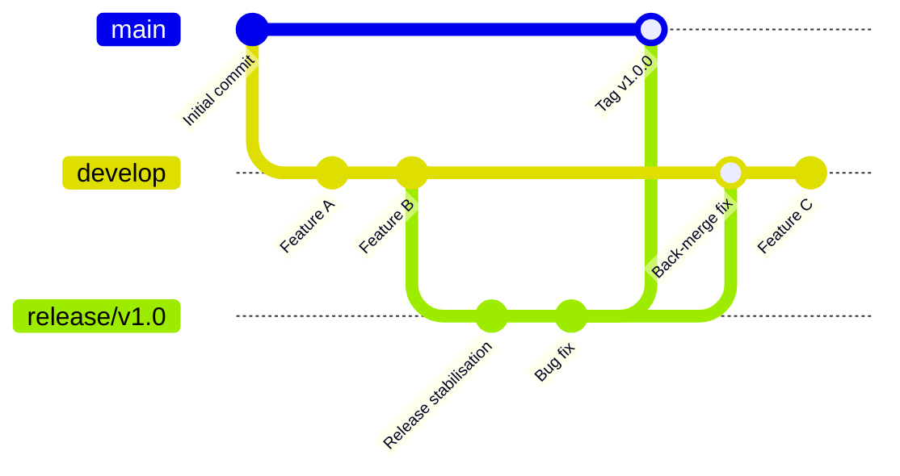
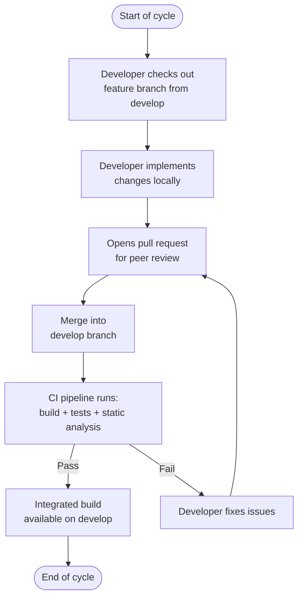
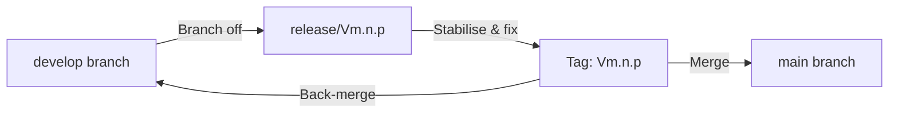
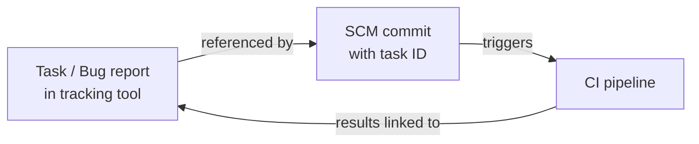

# Software Configuration Management Plan

## Table of Contents

> [!NOTE]
> Update this table of contents to reflect the sections in this document.
> In the MkDocs web view, the table of contents is generated automatically in the sidebar.
> This section is intended for printed or exported (PDF) versions of the document.
>
> Example:
> 1. IDENTIFICATION
> 2. ORGANIZATION
> 3. CONFIGURATION IDENTIFICATION
> 4. CONFIGURATION SECURITY

## 1. IDENTIFICATION

| Field | Value |
|---|---|
| Document ID | <!-- TODO: e.g. PRJ-SCMP-001 --> |
| Title | Software Configuration Management Plan |
| Version | <!-- TODO: e.g. 1.0 --> |
| Date | <!-- TODO: YYYY-MM-DD --> |
| Status | <!-- TODO: Draft / Under Review / Approved --> |

### 1.1 Document Overview

This Software Configuration Management Plan (SCMP) defines the principles, tools, and procedures used to manage software configuration items throughout the <!-- TODO: project name --> project lifecycle. It covers branching strategy, version control, release management, archiving, configuration identification rules, and the security of configuration assets.

**Scope:** All software configuration items (source code, documentation, SOUPs, build artefacts, and release packages) produced or consumed during the <!-- TODO: project name --> project.

**Intended audience:** Software configuration managers, technical leads, developers, and quality managers involved in the <!-- TODO: project name --> project.

--8<-- "snippets/glossary-and-references.md"

## 2. Organization

> [!NOTE]
> Select and keep the organizational model that applies to your project. Delete the alternative.

> [!NOTE]
> **Option A — Shared SCM Department**
> The SCM support department, shared by all projects of the company, manages software configuration.

> [!NOTE]
> **Option B — Project-Based SCM**
> The software configuration is managed by members of the project, with specific tools. Responsibilities are shared between:
>
> - The Software Configuration Manager (SCM),
> - The Project Manager,
> - The Technical Manager.

> [!NOTE]
> Describe the organization in which CM resides. Keep only the option that applies, or write a custom description.

### 2.1. Configuration Management Principles

The SCM is done with <!-- TODO: e.g. Git, SVN, Perforce -->, a SCM tool that has a command line interface and integrates with <!-- TODO: e.g. Redmine, Trac, Jira, GitHub Issues --> task management tool and the <!-- TODO: e.g. Eclipse, Visual Studio Code, IntelliJ IDEA --> Integrated Development Environment.

#### 2.1.1. Branching Strategy

> [!NOTE]
> Describe how you manage different versions with branches, forks, or other means offered by your SCM tool. Adapt the example below or replace with your own diagram.

The following branching model is applied:



> [!TIP]
> Replace the diagram above with the actual branching model used in your project (e.g. GitHub Flow, GitFlow, trunk-based development).

A main development branch, called <!-- TODO: e.g. `main` / `master` / `develop` -->, receives by default all software developments made by the software team. When a new major version is planned (for instance V1.0 or V2.0), a branch is created from the main branch. This branch is isolated to be tested, fixed, and finally delivered.

#### 2.1.2. Diff-Merge Between Branches

> [!NOTE]
> Describe how modifications in a branch (e.g. bug fixes) can be diff-merged into another branch.

Bug fixes applied to a release branch are back-merged into the main development branch using the following procedure:

1. The fix is committed and reviewed on the release branch.
2. A merge request / pull request is opened targeting the main development branch.
3. Conflicts are resolved by the <!-- TODO: Technical Manager / SCM Manager -->.
4. The merge is reviewed and approved before integration.

### 2.2. Configuration Management in a Development Cycle

> [!NOTE]
> Describe how you manage the development cycle: checkout/check-in by each developer, integration branch usage, and how the branch is merged into the current version at the end of the cycle. Adapt the example diagram below.

The changes made by developers during a development cycle are managed as follows:



At the end of each development cycle, the <!-- TODO: develop / integration --> branch is reviewed and merged into the release branch if all acceptance criteria are met.

### 2.3. Configuration Management of Releases

> [!NOTE]
> Explain how a release is managed in configuration: fork, branch, tag, or other mechanism.

When a version is ready for release:

1. A release branch is created from the <!-- TODO: develop / main --> branch: `release/Vm.n.p`.
2. Only stabilisation fixes (no new features) are allowed on the release branch.
3. Once approved, the release is tagged: `Vm.n.p`.
4. The release branch is merged back into <!-- TODO: main / develop --> to propagate fixes.



### 2.4. Configuration Management of Prototypes

> [!NOTE]
> **Optional**
> Include this section only if prototype builds (not CE-marked, not FDA-cleared) are released to selected users for clinical research or similar purposes. Delete this section if not applicable.

> [!NOTE]
> Explain how prototypes are managed in configuration.

Prototype builds released for clinical evaluation or field testing are managed as follows:

- Prototypes are branched from <!-- TODO: develop / main --> and identified with a `prototype/` prefix: e.g. `prototype/clinical-eval-2024-Q1`.
- Prototypes are labelled with a pre-release identifier: e.g. `V1.0.0-alpha.1`.
- A record of each prototype distribution (recipient, date, version) is maintained in <!-- TODO: specify location -->.
- Prototype code is never merged into the main release line without full review and testing.

### 2.5. Tasks in Development and Maintenance

> [!NOTE]
> Describe the SCM operations performed at each phase of the software lifecycle and maintenance. List the locations of changes.

The SCM Manager performs the following operations during the software lifecycle:

| Event | Operation |
|---|---|
| Launching the development of a new product | Creating the source folder structure in the master branch | 
| Deciding to create a major version | Fork of a branch from the current state of the master branch |
| Releasing a major version | Tagging the current version in its branch. Archiving the tagged version |
| Releasing a minor version or a patch | Adding a new tag to the current version in the branch. Archiving the tagged version |
| Closing an iteration cycle | Adding a new tag to the current version in the master branch |
| Other events | <!-- TODO: ... --> |

During software development

| Phase | SCM Activity |
|---|---|
| Software specification | Create version baseline; open specification branch if needed |
| Software design | Branch from develop; commit design artefacts under SCM |
| Software coding | Developers commit on feature branches; branches merged after review |
| Software integration | Integration branch created; automated build and test triggered |
| Software verification | Release branch created; source code frozen for testing |
| Release | Tag applied; release artefacts archived (see §2.6) |
| Maintenance | Bug-fix branches created from the release tag; fixes back-merged into develop |

The software developers update the source code in the branch that corresponds to the state of the software and the type of modification. Changes are located in:

- <!-- TODO: e.g. `src/` — application source code -->
- <!-- TODO: e.g. `config/` — configuration files -->
- <!-- TODO: e.g. `db/` — database migration scripts -->
- <!-- TODO: e.g. `docs/` — technical documentation -->

During software maintenance:

| Type of modification | Location of the modification |
|---|---|
| Creating a new functionality in the next major version (iteration cycles) | In the master branch |
| Creating a new functionality in the next minor version | In the branch of the major version. |
| Modifying an existing functionality in the new minor version | In the branch of the major version. |
| Fixing a bug in a released version | In the branch of the major version |
| Fixing a bug in a version in verification phase (not yet released) | In the branch of the major version in verification phase |


### 2.6. Archiving Versions

Each version is archived on <!-- TODO: a server / network share / cloud storage — provide URL or path -->.

The versions are kept in a tree structure with the following content:

```
Archive/
├── Vm.n.p/
│   ├── sources/          # Source code, configuration files, database scripts
│   ├── binaries/         # Generated binaries and installers
│   ├── documentation/    # Technical documentation
│   └── sbom/             # Software Bill of Materials (SBOM)
```

> [!NOTE]
> Describe the access control and retention policy for the archives.

### 2.7. Link with Bugs and Features

> [!NOTE]
> Explain how the link between the SCM tool and the bug/task tracking tool is made.

Each code commit is linked to a task or bug report in <!-- TODO: e.g. Jira, Redmine, GitHub Issues --> by including the task identifier in the commit message, e.g.:

```
[PROJ-123] Fix incorrect dose calculation in bolus module
```

This integration ensures traceability between:

- A task or bug report in the tracking tool,
- The commit(s) that implement the fix or feature,
- The files and lines of code changed.



At every iteration, it shall be possible to determine which tasks were completed and which parts of the source code changed.

---

## 3. Configuration Identification

### 3.1. Identification Rules of Configuration Items

The identification of a configuration item is:

```
<configuration item name>_Vm.n.p
```

where:

- `Vm` is the major version number,
- `n` is the minor version number,
- `p` is the incremental patch version number, if necessary.

The version number starts at **V1.0.0**.

| Version component | Incremented when |
|---|---|
| `m` — major | Substantial modifications: update of intended use, addition of new modules requiring new regulatory submission |
| `n` — minor | Non-substantial modifications: new functionalities added to existing modules, GUI updates |
| `p` — patch | Minor modifications: corrections to existing functionalities, minor GUI fixes |

> [!NOTE]
> **Agile / Iterative Projects**
> <!-- TODO: If applicable, explain how versions are identified during iterations, e.g. nightly builds, non-stable pre-release tags such as `V1.0.0-beta.3` or `V1.0.0-rc.1`. -->

### 3.2. Identification Rules of SOUPs

SOUPs (Software of Unknown Provenance) are identified by:

- The name of the manufacturer,
- The name of the library or software,
- The version of the library or software.

For open-source SOUPs without a manufacturer name, the name of the open-source project is used.

If a SOUP does not carry its own identification, the rules in §3.1 apply.

| SOUP | Manufacturer | Version | Source |
|---|---|---|---|
| PyTorch | Meta AI (open source) | 2.2.0 | PyPI — pytorch.org |
| <!-- TODO: e.g. OpenSSL --> | <!-- TODO: e.g. OpenSSL Project --> | <!-- TODO: e.g. 3.2.1 --> | <!-- TODO: e.g. https://openssl.org --> |
| <!-- TODO --> | <!-- TODO --> | <!-- TODO --> | <!-- TODO --> |

### 3.3. Identification Rules of Installers

> [!NOTE]
> **Optional**
> Discard this section if there is no installer.

Installers have the same version as the product they install: `<ProductName>_Vm.n.p_installer`.

If an installer covers more than one product, the installer version is the concatenation of each product name and version:

```
<ProductA>_Vm.n.p_<ProductB>_Vm.n.p_installer
```

### 3.4. Identification Rules of Archives

> [!NOTE]
> Describe how archives defined in §2.6 are identified.

Archives are stored in a folder named after the version tag and creation date:

```
<ProjectName>_Vm.n.p_YYYY-MM-DD/
```

Each archive includes a manifest file (`manifest.json` or equivalent) listing all artefacts and their checksums (SHA-256).

### 3.5. Identification Rules of Documents

> [!NOTE]
> If document identification is already described in the main document management procedure of your QMS, reference that procedure here and delete or adapt the content below.

The identification of project documents follows the scheme:

```
XXX-<document number> Rev.<revision index> [Optional descriptive name]
```

where:

- `XXX` is a project acronym (e.g. `SDP` for Software Development Plan),
- `document number` is an incremental number within the project,
- `revision index` is `01` for the first approved revision, `02` for the second, and so on.

> [!TIP]
> To avoid confusion between document revisions and software versions, use the term **revision** for documents and **version** for software. Example: *SDP Rev.03 describes SW version V2.5*.

> [!NOTE]
> **Agile / Iterative Projects**
> <!-- TODO: Explain if there is a special rule to identify document versions during iterations, e.g. draft suffixes or sprint-scoped revision labels. -->

---

## 4. Configuration Security

### 4.1. Security of Assets Managed in Configuration

The following assets are managed in the SCM system and are subject to risks of disclosure, corruption, and deletion:

| Asset | Description | Confidentiality | Integrity | Availability |
|---|---|---|---|---|
| Source code | Application source code and configuration files | <!-- TODO --> | <!-- TODO --> | <!-- TODO --> |
| SOUPs | Third-party libraries and dependencies | <!-- TODO --> | <!-- TODO --> | <!-- TODO --> |
| Private keys / certificates | Code-signing and TLS certificates | <!-- TODO --> | <!-- TODO --> | <!-- TODO --> |
| API keys / credentials | Access tokens for external services | <!-- TODO --> | <!-- TODO --> | <!-- TODO --> |
| Hardware dongles | <!-- TODO --> | <!-- TODO --> | <!-- TODO --> | <!-- TODO --> |
| Build artefacts | Compiled binaries and installers | <!-- TODO --> | <!-- TODO --> | <!-- TODO --> |

> [!NOTE]
> Describe how Confidentiality, Integrity, and Availability of these assets are ensured. Adapt the list below to your project.

The following controls are applied to protect configuration assets:

- **Confidentiality:** Access to repositories is restricted to authorised team members using role-based access control (RBAC) and the principle of least privilege. Sensitive data (credentials, private keys) is never stored in the SCM repository; dedicated secrets managers are used instead.
- **Integrity:** All commits are signed (<!-- TODO: e.g. GPG-signed commits enforced by branch policy -->). Cryptographic hashes (SHA-256) are verified when importing third-party code or SOUP packages from external sources.
- **Availability:** Repositories are hosted on <!-- TODO: e.g. a cloud-based platform with SLA, an on-premises server with nightly backup -->. Backup and recovery procedures are defined in <!-- TODO: reference IT/QMS procedure -->.
- **Audit trail:** Repository activity logs (push, pull request, merge, access) are retained for <!-- TODO: e.g. 3 years --> to support traceability audits.

### 4.2. Integrity and Authenticity of Releases

> [!NOTE]
> Describe how the integrity and authenticity of software releases is ensured. Adapt the examples below.

#### 4.2.1. Release Integrity

Each release artefact (binary, installer, SBOM) is accompanied by a SHA-256 checksum file. Checksums are computed during the CI/CD build pipeline and published alongside the release:

```
<artefact-name>_Vm.n.p.exe
<artefact-name>_Vm.n.p.exe.sha256
```

> [!NOTE]
> Describe who verifies the checksum and at which step (e.g. at delivery, at installation).

#### 4.2.2. Release Authenticity

> [!NOTE]
> Select and describe the applicable authenticity mechanism. Delete what does not apply.

- **Code signing:** Release binaries are signed with a <!-- TODO: e.g. EV code-signing certificate issued by a trusted CA -->. The signature is verified before installation.
- **Source code integrity:** If source code is transferred between repositories (e.g. from internal to customer-facing repo), the integrity of the transfer is verified by comparing SHA-256 hashes of the archive before and after transfer.
