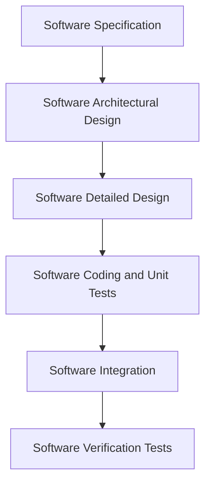
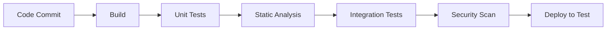

# Software Development Plan

## Table of Contents

> [!NOTE]
> Update this table of contents to reflect the sections in this document.
> In the MkDocs web view, the table of contents is generated automatically in the sidebar.
> This section is intended for printed or exported (PDF) versions of the document.
>
> Example:
> 1. IDENTIFICATION
> 2. SOFTWARE DEVELOPMENT ACTIVITIES
> 3. DEVELOPMENT PROCESS PHASES
> 4. RESPONSIBILITIES

## 1. IDENTIFICATION

| Field | Value |
|---|---|
| Document ID | <!-- TODO: e.g. PRJ-SDP-001 --> |
| Title | Software Development Plan |
| Version | <!-- TODO: e.g. 1.0 --> |
| Date | <!-- TODO: YYYY-MM-DD --> |
| Status | <!-- TODO: Draft / Under Review / Approved --> |

### 1.1 Document Overview

This Software Development Plan (SDP) defines the development process, tools, standards, and phase-by-phase activities for the <!-- TODO: project name --> software development project. It covers the development lifecycle model, toolchain, secure development practices, and the detailed activities, entry/exit criteria, and deliverables for each development phase.

**Scope:** All software development activities for the <!-- TODO: project name --> project, including specification, architectural and detailed design, coding, unit testing, integration, verification testing, and — where applicable — AI/ML training, validation, and testing phases.

**Intended audience:** Developers, technical leads, test engineers, quality managers, and all team members responsible for executing software development activities on the <!-- TODO: project name --> project.

--8<-- "snippets/glossary-and-references.md"

## 2. Software Development Activities

The section list and describes the software development activities of <!-- TODO: XXX --> software development project.

### 2.1. Software Development Process

> [!NOTE]
> Select and keep the development model that applies to your project.

The software development process chosen for the project is the <!-- TODO: waterfall / SCRUM / Extreme Programming --> model.

The <!-- TODO: waterfall / SCRUM / Extreme Programming --> model was chosen for the following reasons:

> [!NOTE]
> Justify the choice of development model, e.g. regulatory traceability requirements, team size, release cadence, customer requirements, complexity of requirements.

#### 2.1.1. Overview of Process Phases

> [!NOTE]
> You may describe your phases in §2.2.x of the Project Management Plan or here. This document is more technical than the Project Management Plan, so you may describe your phases with more technical information.

The lifecycle of the software development project is composed of the following phases:

> [!NOTE]
> Adapt the list below to your project lifecycle. The example below follows a waterfall model.

1. Software specification
2. Software architectural design
3. Software detailed design
4. Software coding and unit tests
5. Software integration
6. Software verification tests

> [!NOTE]
> **AI/ML — Additional Phases**
> If the software includes AI/ML components, the following phases are also required:
>
> - AI training or tuning
> - AI validation
> - AI test

> [!TIP]
> Replace the diagram above with the actual lifecycle model for your project (e.g. iterative Scrum sprints, V-model, etc.). If the project includes AI/ML, add the AI training, AI validation, and AI test phases to the diagram.

#### 2.1.2. End of Phase Reviews

> [!NOTE]
> You may describe your phase reviews in §2.2.x of the Project Management Plan or here. This document is more technical than the Project Management Plan, so you may describe your phase reviews with more technical information.

The phases of the lifecycle are ended by the following reviews:

> [!NOTE]
> Adapt the list below to your project.

| Phase | End-of-Phase Review |
|---|---|
| Software specification | Software specification review |
| Software architectural design | Software architectural design review |
| Software detailed design | Software detailed design review |
| Software coding and unit tests | Automated tests review, unit test review |
| Software integration | Integration test review |
| Software verification tests | Final verification test review |

> [!NOTE]
> **AI/ML — End-of-Phase Reviews**
> If the software includes AI/ML components, the following reviews are also required:
>
> | Phase | End-of-Phase Review |
> |---|---|
> | AI training or tuning | AI training or tuning review |
> | AI validation | AI validation review |
> | AI test | AI test review |

> [!NOTE]
> Provide a planning of phases and reviews here, or reference the Project Management Plan where the planning is described.

> [!TIP]
> The planning of phases and reviews may be given here or in the Project Management Plan.

#### 2.1.3. CI/CD or DevOps Strategy

> [!NOTE]
> **Optional**
> If you have a CI/CD or DevOps strategy, describe it here or reference §2.2.x of the Project Management Plan where it is described.

> [!NOTE]
> Describe the continuous integration / continuous delivery pipeline, including: build automation, automated testing, code quality gates, deployment strategy, and security scanning integration.

#### 2.1.4. Technical Documentation

The following documentation is produced during the design phases:

> [!NOTE]
> Adapt the table below to your project. Add or remove rows as required.

| Phase | Documents Produced |
|---|---|
| Software specification | SRS (including security requirements), IRS, STP (including security tests) |
| Software architectural design | SAD |
| Software detailed design | SDD, IDD, updated STP, STD |
| Software coding and unit tests | STR of unit tests |
| Software verification tests | STR, VDD |

> [!NOTE]
> **AI/ML — Technical Documentation**
> If the software includes AI/ML components, the following documentation is also produced:
>
> | Phase | Documents Produced |
> |---|---|
> | AI training | AI training report (if necessary) |
> | AI validation | AI validation protocol and report |
> | AI test | AI test protocol and report |

#### 2.1.5. Deliverables

The following items are delivered at the end of the process:

> [!NOTE]
> Adapt the list below to your project.

- Technical documentation
- User documentation: user guide, administration procedures, and installation procedure
- Software and its configuration files

### 2.2. Software Development Tools

#### 2.2.1. Workstation

> [!NOTE]
> Describe the typical workstation used for development: hardware specification, operating system, and any specific configuration required.

| Aspect | Description |
|---|---|
| Hardware | <!-- TODO: e.g. x86-64 PC, minimum 16 GB RAM, 512 GB SSD --> |
| Operating System | <!-- TODO: e.g. Ubuntu 22.04 LTS, Windows 11 --> |
| Specific configuration | <!-- TODO: e.g. network access, VPN, virtualisation --> |

#### 2.2.2. Requirements Management and Documentation

> [!NOTE]
> Describe the tools used to write and manage requirements.

| Tool | Version | Purpose |
|---|---|---|
| <!-- TODO: e.g. DOORS, Jama, Polarion, Confluence --> | <!-- TODO --> | Requirements authoring and traceability |
| <!-- TODO: e.g. MS Word, Markdown/Git --> | <!-- TODO --> | Document authoring |
| <!-- TODO --> | <!-- TODO --> | <!-- TODO --> |

> [!TIP]
> Examples of requirements management tools: IBM DOORS, Jama Connect, Polarion, Reqtify, Confluence, Tuleap.

#### 2.2.3. Software Architectural and Detailed Design

> [!NOTE]
> Describe the tools used for software design.

| Tool | Version | Purpose |
|---|---|---|
| <!-- TODO: e.g. Figma --> | <!-- TODO --> | GUI design |
| <!-- TODO: e.g. Archi (Archimate), Gaphor --> | <!-- TODO --> | Architectural design |
| <!-- TODO: e.g. StarUML, PlantUML, Graphviz --> | <!-- TODO --> | Detailed design (UML) |
| <!-- TODO: e.g. Draw.io, MS Visio, yED, Mermaid --> | <!-- TODO --> | General diagrams |
| <!-- TODO: e.g. MONAI, custom Python packages --> | <!-- TODO --> | AI/ML model design |

#### 2.2.4. IDE and Static Source Code Analysis

> [!NOTE]
> Describe the tools used for coding, including plugins, secure coding standards enforcement, and automated analysis.

| Tool | Version | Purpose |
|---|---|---|
| <!-- TODO: e.g. Visual Studio Code, Eclipse, IntelliJ IDEA --> | <!-- TODO --> | Code editing and debugging |
| <!-- TODO: e.g. list of plugins --> | <!-- TODO --> | <!-- TODO --> |
| <!-- TODO: e.g. CPPCheck, CodeSonar, SonarQube --> | <!-- TODO --> | Static source code analysis |
| <!-- TODO: e.g. Anaconda, Spyder --> | <!-- TODO --> | AI/ML development |

#### 2.2.5. Automated Tests

> [!NOTE]
> Describe the tools used for automated tests.

| Tool | Version | Purpose |
|---|---|---|
| <!-- TODO: e.g. CPPUnit, JUnit, PyUnit, Cucumber --> | <!-- TODO --> | Unit and integration testing |
| <!-- TODO: e.g. Selenium, BrowserStack --> | <!-- TODO --> | Functional testing |
| <!-- TODO --> | <!-- TODO --> | <!-- TODO --> |

#### 2.2.6. Configuration Management

> [!NOTE]
> Describe the tools used for configuration management and bug tracking.

| Tool | Version | Purpose |
|---|---|---|
| <!-- TODO: e.g. Git, GitHub, GitLab --> | <!-- TODO --> | Source code version control |
| <!-- TODO: e.g. Maven, Jenkins, GitHub Actions --> | <!-- TODO --> | Build automation |
| <!-- TODO: e.g. Trac, Redmine, Jira, GitHub Issues --> | <!-- TODO --> | Bug and issue tracking |
| <!-- TODO: e.g. DVC, Git LFS --> | <!-- TODO --> | AI/ML data version control |

#### 2.2.7. CI/CD and DevOps

> [!NOTE]
> Describe the tools used for CI/CD and DevOps activities.

> [!WARNING]
> Do not mix development tools with deployment or production tools. This section covers tools used during the development process only.

| Tool | Version | Purpose |
|---|---|---|
| <!-- TODO: e.g. GitHub Actions, GitLab CI, Jenkins --> | <!-- TODO --> | Pipeline orchestration |
| <!-- TODO: e.g. Docker, Kubernetes --> | <!-- TODO --> | Containerisation |
| <!-- TODO --> | <!-- TODO --> | <!-- TODO --> |

### 2.3. Secure Software Development and Testing Tools

#### 2.3.1. SecDevOps Strategy

> [!NOTE]
> **Optional**
> If you have a SecDevOps strategy, describe it here, complementary to the CI/CD or DevOps section above, or reference §2.2.x of the Project Management Plan.

> [!NOTE]
> Describe how security activities are integrated into the development pipeline. Indicate which of the following practices are applied.

| Practice | Tool / Approach | Integration Point |
|---|---|---|
| Static Application Security Testing (SAST) | <!-- TODO --> | <!-- TODO: e.g. Pull request, nightly build --> |
| Dynamic Application Security Testing (DAST) | <!-- TODO --> | <!-- TODO --> |
| Interactive Application Security Testing (IAST) | <!-- TODO --> | <!-- TODO --> |
| Open-Source Analysis (OSA) | <!-- TODO --> | <!-- TODO --> |

#### 2.3.2. Static Source Code Analysis

> [!NOTE]
> Describe the static source code analysis tool(s) used, including whether they enforce both secure coding standards and classical coding rules.

| Tool | Version | Rules / Standards Applied |
|---|---|---|
| SonarQube | 10.x | OWASP Top 10, CWE Top 25, Hotspots review |
| <!-- TODO: e.g. CPPCheck, CodeSonar, SonarQube --> | <!-- TODO --> | <!-- TODO: e.g. CWE Top 25, MISRA C --> |
| <!-- TODO: e.g. GitHub Advanced Security --> | <!-- TODO --> | <!-- TODO --> |

> [!TIP]
> The same tool is often used for both secure coding standard enforcement and classical coding rule verification.

#### 2.3.3. Secure Testing

> [!NOTE]
> Describe the tools used for security testing.

| Tool | Version | Purpose |
|---|---|---|
| DICOM fuzzer, HL7 fuzzer | Vxx | Protocol fuzzing |
| <!-- TODO: e.g. MS Attack Surface Analyser, nmap, zenmap --> | <!-- TODO --> | Attack surface testing |
| <!-- TODO: e.g. Nessus, nmap + vulnscan --> | <!-- TODO --> | Vulnerability scanning |
| <!-- TODO: e.g. Checkmarx --> | <!-- TODO --> | SAST / OSA / IAST |
| <!-- TODO: e.g. OWASP ZAP --> | <!-- TODO --> | DAST |
| <!-- TODO: e.g. Veracode --> | <!-- TODO --> | Software composition analysis |
| <!-- TODO: e.g. Black Duck, Snyk.io, JFrog Xray, Grype --> | <!-- TODO --> | Dependency vulnerability scanning |
| <!-- TODO: e.g. Valgrind, Parasoft --> | <!-- TODO --> | Runtime resource management |

> [!TIP]
> See also: [OWASP Free for Open Source Application Security Tools](https://owasp.org/www-community/Free_for_Open_Source_Application_Security_Tools)

#### 2.3.4. SBOM Generation

> [!NOTE]
> Describe the tool used to generate a Software Bill of Materials (SBOM). Machine-readable formats (CycloneDX, SPDX) are preferred.

| Tool | Version | Output Format |
|---|---|---|
| e.g. CycloneDX Maven plugin | Vxx | CycloneDX JSON/XML |
| <!-- TODO: e.g. CycloneDX BOM npm meta package --> | <!-- TODO --> | CycloneDX JSON |
| <!-- TODO: e.g. Microsoft sbom-tool --> | <!-- TODO --> | SPDX JSON |
| <!-- TODO --> | <!-- TODO --> | <!-- TODO --> |

#### 2.3.5. SOUP Vulnerability Tracking

> [!NOTE]
> Describe the tools used to track vulnerabilities in SOUP (Software of Unknown Provenance) components.

| Tool | Version | Purpose |
|---|---|---|
| e.g. Dependabot, Renovate | Vxx | Automated SOUP vulnerability alerts |
| <!-- TODO --> | <!-- TODO --> | <!-- TODO --> |

> [!TIP]
> SOUP vulnerability tracking is often integrated into the CI/CD pipeline. See also §2.2.7.

### 2.4. Obsolescence Management

> [!NOTE]
> Describe how the obsolescence of the software development tools listed in §2.2 and §2.3 is managed.

> [!NOTE]
> Two typical approaches are:
>
> - **Rolling update:** Tools are updated whenever a new version is released.
> - **Version freeze:** Tools are fixed to a specific version for the duration of the development and maintenance period.
>
> The choice may differ from one tool to another; explain your choices below.

| Tool | Approach | Justification |
|---|---|---|
| Git | Version freeze | Specific version pinned in the development environment setup script to ensure reproducible builds |
| <!-- TODO --> | <!-- TODO: Rolling update / Version freeze --> | <!-- TODO --> |
| <!-- TODO --> | <!-- TODO --> | <!-- TODO --> |

> [!NOTE]
> Describe the procedure applied when a tool version change is assessed and approved.

### 2.5. Software Development Rules and Secure Coding Standards

> [!NOTE]
> Describe the standards and rules applied to software development in this project.

| Standard / Rule | Description | Applicability |
|---|---|---|
| e.g. UML 2.x | Modelling notation for design diagrams | Software modelling conventions |
| <!-- TODO: e.g. Entity-Relationship modelling --> | Data modelling conventions | <!-- TODO --> |
| <!-- TODO: e.g. company coding rules document --> | Coding style and naming conventions | <!-- TODO --> |

**Secure coding standards applied to this project:**

| Standard | Scope | Verification Method |
|---|---|---|
| OWASP Top 10 | All application source code | SonarQube scan on every pull request + security code review checklist |
| <!-- TODO: e.g. MISRA C --> | <!-- TODO: e.g. C source code --> | <!-- TODO: e.g. Static analyser + code review --> |
| <!-- TODO: e.g. SEI CERT C++ --> | <!-- TODO --> | <!-- TODO --> |
| <!-- TODO: e.g. SEI CERT Java --> | <!-- TODO --> | <!-- TODO --> |
| <!-- TODO: e.g. OWASP Top 10 --> | <!-- TODO --> | <!-- TODO --> |

> [!TIP]
> Coding rules may be worth a dedicated document when the rule set is extensive. In that case, add a reference here.

### 2.6. Software Development Platform Security

> [!NOTE]
> Describe how the software development platform is secured, covering the protection of source code, security credentials, and other sensitive development data. This section may reference company-level IT security documents.

| Aspect | Measure |
|---|---|
| Source code access control | e.g. Role-based access, branch protection rules |
| Credentials and secrets management | <!-- TODO: e.g. Secrets manager, no hardcoded credentials --> |
| Developer workstation security | <!-- TODO: e.g. Disk encryption, endpoint protection --> |
| Network security | <!-- TODO: e.g. VPN, network segmentation --> |
| Audit logging | <!-- TODO: e.g. Git audit log, CI/CD pipeline logs --> |

---

## 3. Development Process Phases

> [!NOTE]
> You may describe your phases in §2.2.x of the Project Management Plan or here. This document is more technical than the Project Management Plan, so you may describe your phases with more technical information.

> [!NOTE]
> Add one sub-section per phase listed in §2.1.1. The sub-sections below are provided as examples. Adapt them to your project.

### 3.1. Software Specification

#### 3.1.1. Input Data

> [!NOTE]
> List the input data used as entry criteria for this phase.

- Clinical data and intended use statement
- Preliminary risk analysis (system-level)
- Design history (if applicable, e.g. for a new version)
- System requirements
- <!-- TODO: other relevant inputs -->

> [!NOTE]
> **ISO 13485 Design Inputs**
> Also take into account design input data required by **ISO 13485 §7.3.3**, including functional, performance, and safety requirements; applicable regulatory requirements; outputs of risk management; and any other requirements essential for design and development. Design inputs shall be reviewed for adequacy and approved.

#### 3.1.2. Content

> [!NOTE]
> **IEC 62304 §5.2.2**
> Refer to IEC 62304 §5.2.2 for the required content of software requirements activities.

> [!NOTE]
> **SaMD — IEC 82304-1 §4.5 System Requirements**
> In case of Software as a Medical Device (SaMD), also refer to **IEC 82304-1 §4.5** for system requirements applicable to health software products.

The goal of this phase is to write the software requirements. The following topics shall be addressed (non-exhaustive):

- Functional requirements, performances, and physical characteristics
- Environmental conditions in which the software will operate
- Safety requirements, including requirements derived from risk analysis and those related to operation and maintenance methods
- Ergonomics requirements, including manual operations, human–machine interactions, and human factors
- Security requirements, including requirements on security documentation for integrators and users
- User documentation requirements
- Exploitation by end users

#### 3.1.3. Output Data

> [!NOTE]
> List the output artefacts produced by this phase.

- Software Requirements Specification (SRS), including security requirements
- Interface Requirements Specification (IRS)
- Software Test Plan (STP), including security tests
- <!-- TODO: other outputs -->

#### 3.1.4. Review and Acceptance Criteria

This phase ends with a software specification review.

> [!NOTE]
> Describe the review participants and data reviewed.

| Aspect | Description |
|---|---|
| Participants | <!-- TODO: e.g. Technical Lead, Quality Engineer, Project Manager --> |
| Data reviewed | SRS, IRS, STP |

The results of this phase shall be verified against the following criteria:

- Requirements traceability to system requirements and risk analysis
- Coherence with external systems and interfaces
- Internal coherence of requirements
- Testability of all requirements
- Feasibility of software detailed design
- Feasibility of operation and maintenance

---

### 3.2. Software Architectural Design

> [!NOTE]
> Add sub-sections for Input Data, Content, Output Data, and Review and Acceptance Criteria following the same pattern as §3.1.

#### 3.2.1. Input Data

- Approved SRS, IRS, STP
- <!-- TODO -->

#### 3.2.2. Content

> [!NOTE]
> Describe the activities of this phase.

#### 3.2.3. Output Data

- Software Architecture Document (SAD)
- <!-- TODO -->

#### 3.2.4. Review and Acceptance Criteria

> [!NOTE]
> Describe the review and acceptance criteria for this phase.

---

### 3.3. Software Detailed Design

> [!NOTE]
> Add sub-sections for Input Data, Content, Output Data, and Review and Acceptance Criteria.

#### 3.3.1. Input Data

- Approved SAD
- <!-- TODO -->

#### 3.3.2. Content

> [!NOTE]
> Describe the activities of this phase.

#### 3.3.3. Output Data

- Software Design Document (SDD)
- Interface Design Document (IDD)
- Updated STP, Software Test Description (STD)
- <!-- TODO -->

#### 3.3.4. Review and Acceptance Criteria

> [!NOTE]
> Describe the review and acceptance criteria for this phase.

---

### 3.4. Software Coding and Unit Tests

> [!NOTE]
> Add sub-sections for Input Data, Content, Output Data, and Review and Acceptance Criteria.

#### 3.4.1. Input Data

- Approved SDD, IDD, STD
- <!-- TODO -->

#### 3.4.2. Content

> [!NOTE]
> Describe the activities of this phase.

#### 3.4.3. Output Data

- Source code under configuration management
- Software Test Report (STR) for unit tests
- <!-- TODO -->

#### 3.4.4. Review and Acceptance Criteria

> [!NOTE]
> Describe the review and acceptance criteria for this phase.

---

### 3.5. Software Integration

> [!NOTE]
> Add sub-sections for Input Data, Content, Output Data, and Review and Acceptance Criteria.

#### 3.5.1. Input Data

- Unit-tested software components
- STD
- <!-- TODO -->

#### 3.5.2. Content

> [!NOTE]
> Describe the activities of this phase.

#### 3.5.3. Output Data

- Integrated software build under configuration management
- STR of integration tests
- <!-- TODO -->

#### 3.5.4. Review and Acceptance Criteria

> [!NOTE]
> Describe the review and acceptance criteria for this phase.

---

### 3.6. Software Verification Tests

> [!NOTE]
> Add sub-sections for Input Data, Content, Output Data, and Review and Acceptance Criteria.

#### 3.6.1. Input Data

- Integrated software build
- STP, STD
- <!-- TODO -->

#### 3.6.2. Content

> [!NOTE]
> Describe the activities of this phase.

#### 3.6.3. Output Data

- Software Test Report (STR)
- Version Description Document (VDD)
- <!-- TODO -->

#### 3.6.4. Review and Acceptance Criteria

> [!NOTE]
> Describe the review and acceptance criteria for this phase.

---

### 3.7. AI Training or Tuning

> [!NOTE]
> **Optional — AI/ML Projects Only**
> Include this section only if the software includes AI/ML components.

#### 3.7.1. Input

- AI model specifications (may be a subset of the SRS)
- A list of candidate models designed by data scientists
- Training dataset
- A list of hyper-parameters to be set by data scientists

#### 3.7.2. Activities

- Train all (or most) candidate AI/ML models using the training dataset
- From a process viewpoint, the training method can be any suitable method for the models; it shall be documented in the AI development plan

> [!NOTE]
> Reference the AI development plan if applicable.

#### 3.7.3. Output

- Trained models

---

### 3.8. AI Validation

> [!NOTE]
> **Optional — AI/ML Projects Only**
> Include this section only if the software includes AI/ML components.

#### 3.8.1. Input

- Trained models

#### 3.8.2. Activities

- Validate models with the validation dataset
- Model validation techniques will differ depending on the type of model; a typical technique is cross-validation

#### 3.8.3. Output

- One or more best-performing trained models
- Or a return to AI training if results do not match acceptance criteria

---

### 3.9. AI Test

> [!NOTE]
> **Optional — AI/ML Projects Only**
> Include this section only if the software includes AI/ML components.

#### 3.9.1. Input

- AI test plan with acceptance criteria, derived from AI model specifications
- One or more best-performing trained models
- Test dataset, kept separate from training and validation datasets

#### 3.9.2. Activities

- Validate the performance of the best AI model with the test dataset
- The techniques used for AI tests will be described in the future IEC 63521

> [!NOTE]
> Reference the AI test plan.

#### 3.9.3. Output

- Best-performing model selected
- AI model test report
- Model card

---

## 4. Responsibilities

> [!WARNING]
> This section is mandatory. Every activity must have an identified responsible person.

### 4.1. Activities and Responsibilities

Each development activity has a single person responsible. For small teams, the same person may be responsible for multiple activities.

> [!NOTE]
> Complete the table below for each activity.

| Activity | Responsible Person / Role |
|---|---|
| Software specification | e.g. Product champion --> |
| Software architectural design | <!-- TODO --> |
| Software detailed design | <!-- TODO --> |
| Software coding | <!-- TODO --> |
| Unit tests | <!-- TODO --> |
| Software integration | <!-- TODO --> |
| Software verification tests | <!-- TODO --> |
| Security testing | <!-- TODO --> |
| AI training or tuning | <!-- TODO --> |
| AI validation | <!-- TODO --> |
| AI test | <!-- TODO --> |
| <!-- TODO --> | <!-- TODO --> |

### 4.2. Documentation of Activities and Responsibilities

The person responsible for writing a document is not necessarily the person responsible for the activity. In general, the activity owner approves what the document author wrote. For small teams, technical control and approval may be performed by the same person.

> [!NOTE]
> Complete the table below for each document produced during the project.

| Document | Author (Role) | Technical Controller (Role) | Approver (Role) |
|---|---|---|---|
| SRS | <!-- TODO --> | <!-- TODO --> | <!-- TODO --> |
| IRS | <!-- TODO --> | <!-- TODO --> | <!-- TODO --> |
| STP | <!-- TODO --> | <!-- TODO --> | <!-- TODO --> |
| SAD | <!-- TODO --> | <!-- TODO --> | <!-- TODO --> |
| SDD | <!-- TODO --> | <!-- TODO --> | <!-- TODO --> |
| IDD | <!-- TODO --> | <!-- TODO --> | <!-- TODO --> |
| STD | <!-- TODO --> | <!-- TODO --> | <!-- TODO --> |
| STR (unit tests) | <!-- TODO --> | <!-- TODO --> | <!-- TODO --> |
| STR (verification tests) | <!-- TODO --> | <!-- TODO --> | <!-- TODO --> |
| VDD | <!-- TODO --> | <!-- TODO --> | <!-- TODO --> |
| AI training report | <!-- TODO --> | <!-- TODO --> | <!-- TODO --> |
| AI validation report | <!-- TODO --> | <!-- TODO --> | <!-- TODO --> |
| AI test report | <!-- TODO --> | <!-- TODO --> | <!-- TODO --> |
| <!-- TODO --> | <!-- TODO --> | <!-- TODO --> | <!-- TODO --> |
