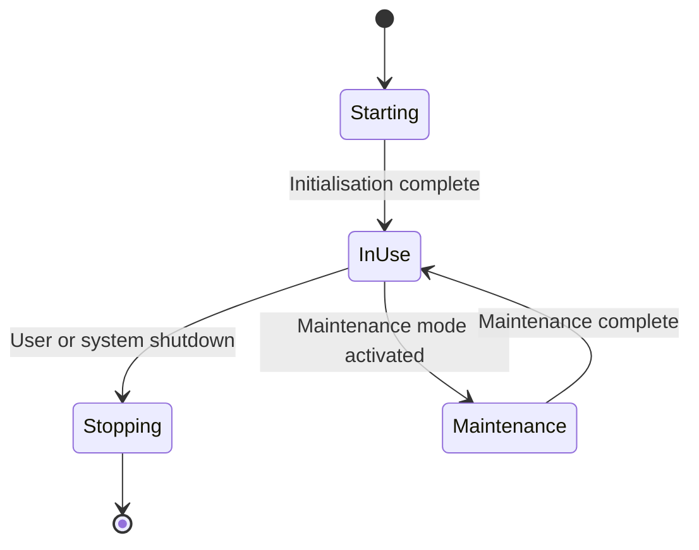

# Software Requirements Specification

## Table of Contents

> [!NOTE]
> Update this table of contents to reflect the sections in this document.
>      In the MkDocs web view, the table of contents is generated automatically in the sidebar.
>      This section is intended for printed or exported (PDF) versions of the document.
>
> Example:
> 1. IDENTIFICATION
>    1.1 Document Overview
>    1.2 Abbreviations and Glossary
>    1.3 References
>    1.4 Conventions
>    1.5 Requirements Structure
> 2. REQUIREMENTS
>    2.1 States
>    2.2 Functionalities and Performance
>    2.3 Security and Privacy Protection
>    2.4 User Maintenance
>    2.5 Usability and Human-Factors Engineering
>    2.6 Regulatory Requirements
>    2.7 System Environment
>    2.8 External Interfaces
>    2.9 Resources
>    2.10 Internal Data
>    2.11 Configuration or Adaptation
>    2.12 Verification
>    2.13 Personnel and Training
>    2.14 Packaging and Installation
>    2.15 Software Updates
>    2.16 Decommissioning – Uninstallation
>    2.17 Secure Operations Guidelines
> 3. REQUIREMENTS TRACEABILITY
> 4. CYBERSECURITY CONTROLS TRACEABILITY
> 5. CRITICAL REQUIREMENTS

## 1. IDENTIFICATION

| Field | Value |
|---|---|
| Document ID | <!-- TODO: e.g. PRJ-SRS-001 --> |
| Title | Software Requirements Specification |
| Version | <!-- TODO: e.g. 1.0 --> |
| Date | <!-- TODO: YYYY-MM-DD --> |
| Status | <!-- TODO: Draft / Under Review / Approved --> |

### 1.1 Document Overview

This document presents the Software Requirements Specification (SRS) of the <!-- TODO: project name --> software development project.

It describes:

- Requirements of functionalities, performances, interfaces, and environment;
- Test principles and definitions of validation methods of requirements;
- The compliance of requirements to customer needs;
- The relative importance and precedence of requirements.

**Scope:** <!-- TODO: Describe the scope of this document, e.g. which software items or modules are covered. -->

**Intended audience:** <!-- TODO: e.g. Software developers, test engineers, quality managers, regulatory affairs. -->

--8<-- "snippets/glossary-and-references.md"

### 1.5 Requirements Structure

Requirements listed in this document are constructed according to the following structure:

| Requirement ID | Title | Requirement | Verification method |
|---|---|---|---|
| SRS-XXX-000 | Title of XXX-000 requirement | Description of XXX-000 requirement | Verification method of XXX-000 requirement |

Example:

| Requirement ID | Title | Requirement | Verification method |
|---|---|---|---|
| SRS-GUI-010 | Main Window Background Color | The background color of the main window is grey RGB(192,192,192) | Demonstration |

## 2. REQUIREMENTS

### 2.1 States

> [!NOTE]
> This section is optional and more relevant for embedded software. For standalone software (SaMD) it can be deleted if not applicable.

> [!NOTE]
> Describe the operational states of the software. List all states and their meaning.
>
> Example states:
> - **Starting** – the software loads its components.
> - **In use** – all functionalities of the software are available to users.
> - **Stopping** – the software is being stopped.
> - **Maintenance** – the software is in maintenance mode.
> - **Updating** – the software is being updated.

> [!NOTE]
> Add a state-transition diagram if necessary. Example:

### 2.2 Functionalities and Performance

> [!NOTE]
> This is the core of the SRS. It contains the purpose of the software expressed in technical requirements. Requirements shall not be vague — they shall be understandable and testable. Ask yourself *"How am I going to test this?"* when writing a requirement.

> [!TIP]
> **Organising this section**
> You may organise this section by modules, by functions, or by any structure that best fits your project. Examples:
>
> - Module 1 → Function 1.1, Function 1.2 …
> - Function 1 → Sub-Function 1.1, Sub-Function 1.2 …

> [!NOTE]
> Add sub-sections for each module or functional area. Structure the requirements using a consistent requirement ID scheme, e.g.:

| Requirement ID | Title | Requirement | Verification method |
|---|---|---|---|
| SRS-FUN-001 | <!-- TODO --> | <!-- TODO: Requirement text --> | <!-- TODO: e.g. Demonstration / Test / Inspection / Analysis --> |
| SRS-FUN-002 | <!-- TODO --> | <!-- TODO --> | <!-- TODO --> |

### 2.3 Security and Privacy Protection

> [!NOTE]
> This section covers software security features: confidentiality, integrity control, reliability, and availability. Refer to applicable cybersecurity standards and regulatory guidance when completing this section.

> [!NOTE]
> **Regulatory references**
> - FDA guidance on Cybersecurity in Medical Devices
> - MDS2 (Manufacturer Disclosure Statement for Medical Device Security) — NEMA
> - IEC/TR 60601-4-5 — General security requirements
> - IEC 81001-5-1 — Security activities in the product life cycle

> [!NOTE]
> Add sub-sections as needed. Suggested topics include:
> - Confidentiality, integrity, availability
> - Virus and malware protection
> - Operational security

| Requirement ID | Title | Requirement | Verification method |
|---|---|---|---|
| SRS-SEC-010 | Two factors authentication | XXX connection shall be confirmed with two factor authentication. Authorized factors are: Text message confirmation, or Authentication app. | Demonstration |
| SRS-SEC-020 | Patient Data | XXX stores patient data with a checksum to ensure their integrity. | Analysis |
| SRS-SEC-030 | Password protected functions | The following functions are protected by password:	Configuration and Firmware update | Demonstration |
| SRS-SEC-040 | <!-- TODO --> | <!-- TODO --> | <!-- TODO --> |

#### 2.3.1 Security Monitoring

> [!NOTE]
> Describe software features allowing users or administrators to monitor software security (e.g. audit logs, alerts, dashboards).

| Requirement ID | Title | Requirement | Verification method |
|---|---|---|---|
| SRS-SEC-MON-010 | Audit Logs | XXX software stores in audit logs the following information: (1) Failed user login attempts, (2) Failed 3rd party software connection attempts, (3) Changing user rights, (4) Moving file from private to public repository | Demonstration |
| SRS-SEC-MON-020 | Audit Logs aggregation | XXX software shall be able to send audit logs to a SIEM log aggregator | Demonstration |

#### 2.3.2 Personal Data

> [!NOTE]
> **Regulatory references**
> - HIPAA (USA)
> - Regulation (EU) 2016/679 — GDPR, especially Articles 15 to 22

> [!NOTE]
> Describe requirements for the management of personal data to ensure compliance with applicable privacy regulations.

| Requirement ID | Title | Requirement | Verification method |
|---|---|---|---|
| SRS-SEC-PDA-010 | Right to forget | XXX software has a function to delete all patient data. The deletion is permanent and not reversible | Analysis |
| SRS-SEC-PDA-020 | <!-- TODO --> | <!-- TODO --> | <!-- TODO --> |

### 2.4 User Maintenance

> [!NOTE]
> Describe maintenance functions accessible by users or administrators. Add sub-sections if there are different user roles with different maintenance capabilities.

| Requirement ID | Title | Requirement | Verification method |
|---|---|---|---|
| SRS-MNT-010 | Application logs | XXX generates a log file containing: (1) The state of the application and the steps performed to reach that state, (2) The possible error logs, if any. | Demonstration |
| SRS-MNT-020 | Idle software when cleaning the device | XXX can be put in idle state by the user to clean the touchscreen with swipes. Exit of idle state is automatic after TTT seconds | Demonstration |
| SRS-MNT-030 | <!-- TODO --> | <!-- TODO --> | <!-- TODO --> |

### 2.5 Usability and Human-Factors Engineering

> [!NOTE]
> Requirements in this section may have traceability with the results of IEC 62366-1 implementation or the FDA Human Factors guidance document.

#### 2.5.1 Man-Machine Interface Layout

> [!NOTE]
> Instead of purely textual requirements, diagrams, mock-ups, or state-transition GUI diagrams (e.g. made with Figma) can be much more convenient. If the software has no GUI (e.g. REST APIs only), leave this section blank.

> [!NOTE]
> Describe the layout of the software GUI, or reference an external GUI specification document.

> [!NOTE]
> Add requirements for GUI characteristics as needed. Topics may include:
> - Visual design (colour scheme, typography, whitespace)
> - Interactivity (hover effects, click feedback, gestures)
> - Accessibility (colour contrast, screen reader compatibility, keyboard navigation)
> - Consistency (uniform design patterns, standardised icons)
> - Feedback and status (loading indicators, error messages, notifications)
> - Customisation (theming, user preferences, screen orientations)
> - Localisation (multiple languages, date/time/number formats)
> - Performance (responsiveness, smooth animations)
> - Integration (OS conventions, dark mode support)

> [!NOTE]
> You can also describe GUI characteristics in a separate document outside SRS (put simply the list in a new document). That document may be referenced here and in the usability file.

| Requirement ID | Title | Requirement | Verification method |
|---|---|---|---|
| SRS-GUI-010 | Menu items and other widgets |  XXX software has the following items: (1) Menu file,  (2) Widgets in the main window (slider, button, radiobutton, textfield), (3) ... | Demonstration |
| SRS-GUI-020 | <!-- TODO --> | <!-- TODO --> | <!-- TODO --> |

#### 2.5.2 Help

> [!NOTE]
> **Regulatory reference**
> See e-IFU regulation: Commission Implementing Regulation (EU) 2021/2226.

> [!NOTE]
> Describe requirements for the user guide or online help system. If the software has no GUI, describe any relevant output (e.g. PDF generation on request).

| Requirement ID | Title | Requirement | Verification method |
|---|---|---|---|
| SRS-HLP-010 | Online user guide | XXX contains an online user guide accessible in the Help/About window | Demonstration |
| SRS-HLP-020 | <!-- TODO --> | <!-- TODO --> | <!-- TODO --> |

### 2.6 Regulatory Requirements

> [!NOTE]
> Regulations can have an impact on software design. For example, Unique Device Identification (UDI), CE marking display, or FDA 21 CFR Part 11 electronic records requirements.

> [!NOTE]
> Identify regulations that impose specific software design requirements and express them as testable requirements. Examples:
> - An "About" window displaying the software version and UDI.
> - A CE mark displayed in the GUI or available on request.
> - If your software doesn’t contain an GUI (e.g.: only REST APIs), it may still output an image with a specific request.

| Requirement ID | Title | Requirement | Verification method |
|---|---|---|---|
| SRS-REG-010 | About XXX | XXX shall display an “About…” window. This window displays: (1) The current version of the application, (2) The UDI, (3) The manufacturer name and address with “black factory” pictogram, (4) ...  | Demonstration |
| SRS-REG-020 | CE Mark | XXX shall display the CE Mark in the “About…” window. The CE Mark is displayed with the 4-digits number of the notified body | Demonstration |
| SRS-REG-030 | <!-- TODO --> | <!-- TODO --> | <!-- TODO --> |

### 2.7 System Environment

> [!NOTE]
> If the software is integrated in a specific system, describe the system briefly and add specific integration requirements. For PEMS/electro-medical devices with a hardware system architecture, a System Architecture Document is required.

> [!NOTE]
> Describe the system context (e.g. cloud platform, mobile platform, on-premise server, embedded system). Reference the system architecture documentation if applicable.

Example with a system, which is not a medical device:

| Requirement ID | Title | Requirement | Verification method |
|---|---|---|---|
| SRS-ENV-010 | Host System | XXX is a module integrated in <MyBigHealthSystem>. MyBigHealthSystem exposes services used by XXX. | Inspection |

Note: <MyBigHealthSystem> services are described in <MyBigHealthSystem> architecture documentation ref XXX.

Example with a mobile platform:

| Requirement ID | Title | Requirement | Verification method |
|---|---|---|---|
| SRS-ENV-020 | Mobile platform | XXX software is a mobile app running on the following platforms: (1) ApricotOS, (2) RobotOS | Demonstration |

Example with cloud-based system:

| Requirement ID | Title | Requirement | Verification method |
|---|---|---|---|
| SRS-ENV-030 | Host System | XXX software is a cloud-based application on THEFANCYGAFAM. THEFANCYGAFAM exposes services used by XXX: (1) NoSQL Database, (2) Web server, ... | Inspection |

### 2.8 External Interfaces

> [!NOTE]
> This section describes hardware and software interfaces of the software within the system. An Interface Requirements Specification / Interface Design Document (IRS/IDD) may be used instead of or in addition to this section.

Examples: 
| Requirement ID | Title | Requirement | Verification method |
|---|---|---|---|
| SRS-INT-010 | REST API | XXX exposes REST APIs for xxxx | Test |
| SRS-INT-020 | DICOM node | XXX exposes a DICOM node with the following characteristics: xxx | Test |

#### 2.8.1 Hardware Interfaces

> [!NOTE]
> For PEMS/electro-medical devices, add requirements about software–hardware integration. Less relevant for software running on a general-purpose OS.

| Requirement ID | Title | Requirement | Verification method |
|---|---|---|---|
| SRS-HWI-010 | Pressure sensor | XXX receives data from the pressure sensor from serial port #nn | Test |

#### 2.8.2 Network Interfaces

> [!NOTE]
> Describe communication and network requirements (wired, wireless, Bluetooth, etc.).

| Requirement ID | Title | Requirement | Verification method |
|---|---|---|---|
| SRS-NET-010 | Wireless communication | XXX shall be able to communicate over the zigbee channel the following information: (1) Status, (2) Battery level | Demonstration |

#### 2.8.3 Data Exchange

> [!NOTE]
> If the software interoperates with other software, describe requirements on data exchange formats, protocols, and standards.

| Requirement ID | Title | Requirement | Verification method |
|---|---|---|---|
| SRS-DAT-001 | DICOM Protocol | XXX communicates with PACS servers with the use of the DICOM protocol, version xx | Test |

### 2.9 Resources

#### 2.9.1 Hardware Resources

> [!NOTE]
> Specify minimum and recommended hardware requirements. Examples:
> - For PC: processor, RAM, storage, display resolution.
> - For mobile: minimum OS version, screen size, sensors required.
> - For cloud: virtual CPU, RAM, storage, network bandwidth.

Example for PC:
| Requirement ID | Title | Requirement | Verification method |
|---|---|---|---|
| SRS-RES-HW-010 | Hardware configuration | XXX shall run with the expected response times on a PC with the following minimal configuration: (1) 64 Go RAM, (2) 16 CPU cores, (3) 1024 GPU | Inspection |

Example for mobile apps, it can be difficult to be specific, if you want to install your app on any device:
| Requirement ID | Title | Requirement | Verification method |
|---|---|---|---|
| SRS-RES-HW-010 | Hardware configuration | XXX shall run with the expected response times on a mobile platform with the following minimal configuration: (1) 16 Go RAM, (2) Aaa x bbb minimal screen resolution, (3) Aaa x bbb minimal camera resolution | Inspection |

Example On the cloud, virtual hardware requirements are possible:
| Requirement ID | Title | Requirement | Verification method |
|---|---|---|---|
| SRS-RES-HW-010 | Hardware configuration | XXX shall run with the expected response times on a virtual machine / container engine with the following minimal configuration: (1) 2 Go RAM, (2) CPU (3) Network, ... | Inspection |

#### 2.9.2 Software Resources

> [!NOTE]
> Specify the software environment requirements. Examples:
> - Operating system and version.
> - Runtime environments (e.g. JRE, .NET, Python interpreter).
> - Third-party libraries and their versions.
> - Database engine and version.
> Note: for PC applications, versions may be less precise; for cloud deployments, versions may change frequently and be frozen at release time.

| Requirement ID | Title | Requirement | Verification method |
|---|---|---|---|
| SRS-RES-SW-010 | Software configuration | XXX runs in the following software environment: (1) 	(describe OS version), (2) (For cloud-based, describe containerization versions, if possible), (3) (database version). | Inspection |
| SRS-RES-SW-020 | <!-- TODO --> | <!-- TODO --> | <!-- TODO --> |

### 2.10 Internal Data

> [!NOTE]
> This section is optional. Include it only when specific requirements for internal data (databases, binary files, JSON, XML, etc.) are needed — for example, when internal data design mitigates a risk identified in the risk analysis.

> [!NOTE]
> Describe requirements for internal data structures, formats, or databases if applicable.

| Requirement ID | Title | Requirement | Verification method |
|---|---|---|---|
| SRS-DAT-010 | <!-- TODO --> | <!-- TODO --> | <!-- TODO --> |

### 2.11 Configuration or Adaptation

> [!NOTE]
> Describe requirements for software configurability or adaptability (e.g. configuration files, database parameters, admin/user GUI for configuration).

| Requirement ID | Title | Requirement | Verification method |
|---|---|---|---|
| SRS-CNF-010 | <!-- TODO --> | <!-- TODO --> | <!-- TODO --> |

### 2.12 Verification

> [!NOTE]
> This section is optional. Include special verification functions only when needed (e.g. a hidden function to activate a log file during beta testing). Such functions must be stripped from the production release and must not introduce security vulnerabilities.

> [!NOTE]
> Describe any built-in verification or diagnostic functions, if applicable.

| Requirement ID | Title | Requirement | Verification method |
|---|---|---|---|
| SRS-VRF-010 | <!-- TODO --> | <!-- TODO --> | <!-- TODO --> |

### 2.13 Personnel and Training

> [!NOTE]
> Describe requirements for user capabilities, qualifications, or training before using the software. If these are already defined at system or product level, this section may be left blank or reference those documents.

| Requirement ID | Title | Requirement | Verification method |
|---|---|---|---|
| SRS-TRN-010 | E-learning | XXX is delivered with e-learning module | Inspection |
| SRS-TRN-020 | <!-- TODO --> | <!-- TODO --> | <!-- TODO --> |

### 2.14 Packaging and Installation

> [!NOTE]
> That kind of requirement can already be present at system level document or product level document. Then, this section may be left blank, unless this is here refined.

> [!NOTE]
> Describe requirements for software packaging and installation. If already defined at system or product level, this section may reference those documents or be left blank.
> Examples:
> - Delivery on physical media (USB, DVD): labelling, packaging requirements.
> - Automated installation: installer validation, silent install, rollback.
> - Mobile apps: deployment via app store, enterprise distribution.

If you deliver on some hardware media:
| Requirement ID | Title | Requirement | Verification method |
|---|---|---|---|
| SRS-PKG-010 | Packaging | XXX shall be delivered on zzz media. | Inspection |

If the installation can be automated:
| Requirement ID | Title | Requirement | Verification method |
|---|---|---|---|
| SRS-PKG-010 | Install bundle| XXX shall be installed with the use of an install bundle | Demonstration |

For mobile apps, we remain only at technical level. The way the app is deployed on the store is not part of this document.
| Requirement ID | Title | Requirement | Verification method |
|---|---|---|---|
| SRS-PKG-010 | APK | XXX shall be installed with the use of an APK accepted by RobotOS based systems. | Demonstration |

### 2.15 Software Updates

> [!NOTE]
> Describe requirements for software update mechanisms. Particularly relevant for mobile apps and devices where end-users install updates. May be less relevant for cloud software managed by administrators.

| Requirement ID | Title | Requirement | Verification method |
|---|---|---|---|
| SRS-UPD-010 | Version update | When it starts, XXX software shall be able to detect if a new software version is available. If the version is mandatory, XXX software shall install the new version and restart. If the version is optional, XXX software shall propose to the user to install it.  | Demonstration |

### 2.16 Decommissioning – Uninstallation

> [!NOTE]
> Describe requirements for uninstalling or decommissioning the software (e.g. data deletion, licence deactivation, hardware removal). If already defined at system or product level, this section may reference those documents or be left blank.

| Requirement ID | Title | Requirement | Verification method |
|---|---|---|---|
| SRS-DEC-010 | Uninstall | XXX is delivered with an uninstaller. The uninstaller allows the user to export personal data prior to uninstallation. | Demonstration |
| SRS-DEC-020 | Erasing personal data | XXX shall erase personal data using the DoD 5220.22-M algorithm | Test |
| SRS-DEC-030 | <!-- TODO --> | <!-- TODO --> | <!-- TODO --> |

### 2.17 Secure Operations Guidelines

> [!NOTE]
> When secure operations cannot be handled by the manufacturer, they shall be documented as guidelines in accompanying documentation (risk transfer). Requirements in this section should derive from cybersecurity risk controls. If already documented at system or product level, this section may be removed.

> [!NOTE]
> Describe secure operations guidelines to be communicated to users or administrators (e.g. password policies, network segmentation, backup procedures, incident response).

| Requirement ID | Title | Requirement | Verification method |
|---|---|---|---|
| SRS-SOP-010 | Statement about account management | Secure operations guidelines shall contain a statement about account management by the HCP | Inspection |
| SRS-SOP-020 | Statement and warning about automatic security updates | Secure operations guidelines shall contain: (1) A statement about setting the OS automatic security updates to “enabled”, (2) A warning reminding the reader that disabling OS automatic security updates may put the device at risk | Inspection |
| SRS-SOP-030 | <!-- TODO --> | <!-- TODO --> | Inspection |

## 3. REQUIREMENTS TRACEABILITY

> [!NOTE]
> Add a traceability table linking software requirements in this document to upstream user, system, or product requirements.

| SRS Requirement ID | SRS Req. Title | Upstream Req. ID | Upstream Req. Title |
|---|---|---|---|
| SRS-FUN-001 | Reading ECG values | FUN-REQ-001 | ECG post treatment |
| SRS-FUN-002 | Writing Results | FUN-REQ-001 | ECG post treatment |
| <!-- TODO --> |<!-- TODO --> | <!-- TODO --> | <!-- TODO --> |

## 4. CYBERSECURITY CONTROLS TRACEABILITY

> [!NOTE]
> **Optional section**
> The FDA guidance on Cybersecurity in Medical Devices recommends documenting traceability between software requirements and cybersecurity control types. Some controls may be documented in other artefacts (e.g. the development plan or security risk assessment). This traceability may alternatively be placed in, or duplicated in, the security risk assessment report.

> [!NOTE]
> Map SRS requirements to the applicable FDA cybersecurity control types:
> A) Authentication controls
> B) Authorization controls
> C) Cryptography controls
> D) Code, data, and execution integrity controls
> E) Confidentiality controls
> F) Event detection and logging controls
> G) Resiliency and recovery controls
> H) Firmware and software update controls

| SRS Requirement ID | Requirement Title | Control Type | Notes |
|---|---|---|---|
| SRS-AUTH-001 | User authentication by login and pasword | A. Authentication controls | <!-- TODO --> |
| SRS-DAT-001 | Database encryption | C. Confidentiality controls | <!-- TODO --> |
| <!-- TODO --> | <!-- TODO --> | <!-- TODO --> | <!-- TODO --> |

## 5. CRITICAL REQUIREMENTS

> [!NOTE]
> **Optional section**
> Add here a list of critical requirements, or references to requirements defined in previous sections. This list is typically derived from risk analysis (ISO 14971) or human factors engineering.

> [!NOTE]
> List critical requirements if applicable.

| Requirement ID | Requirement Title | Origin |
|---|---|---|
| SRS-010 | Alarm when value out of range | Risk analysis |
| SRS-020 | Do not open file if no patient name | Risk analysis |
| SRS-030 | Display blinking when negative values | Human factor engineering |
| <!-- TODO --> | <!-- TODO --> | <!-- TODO --> |
