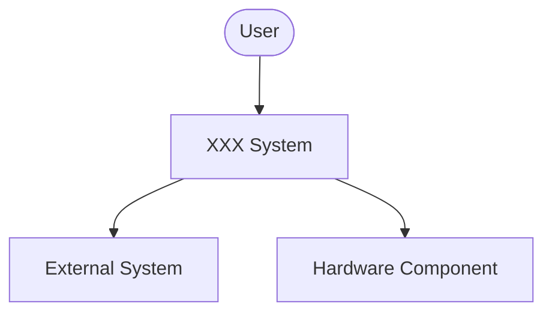
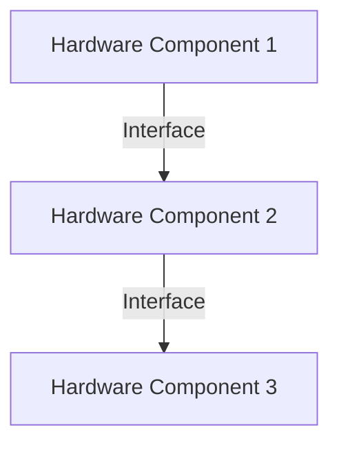
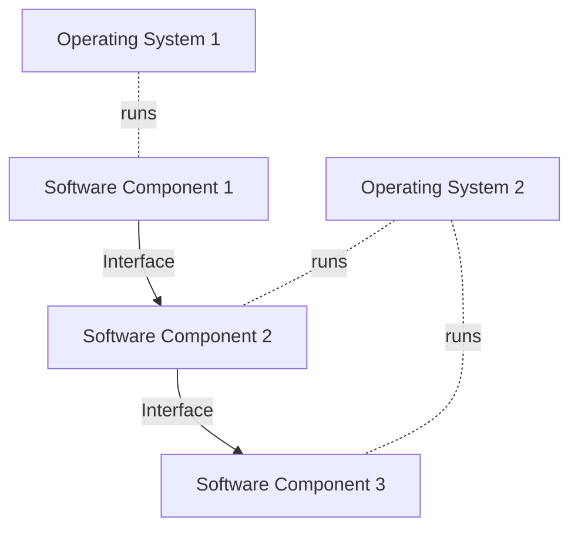
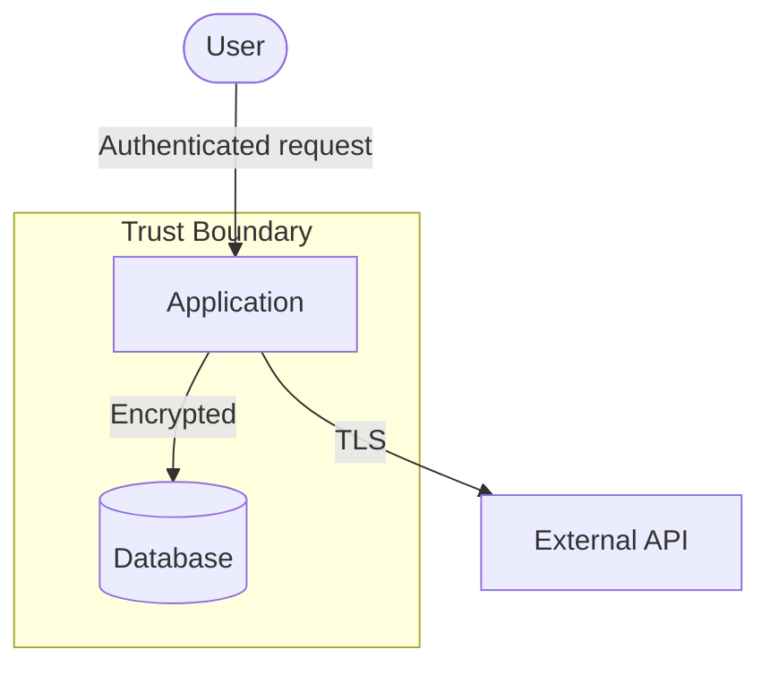
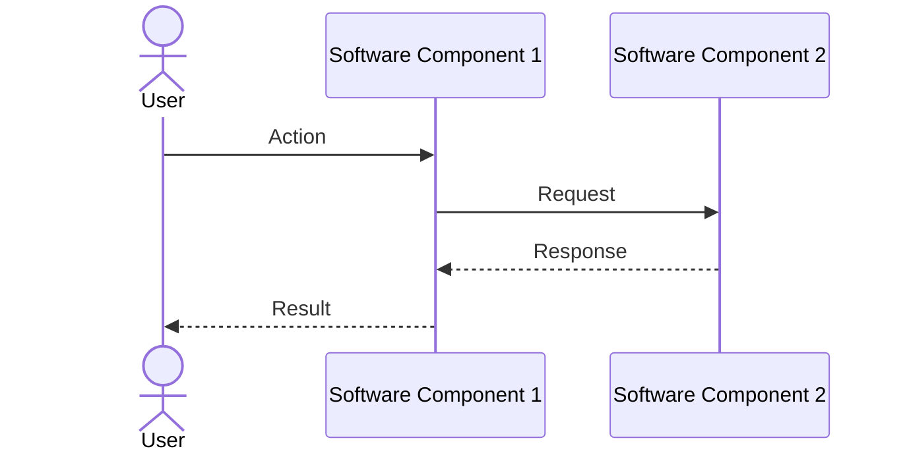
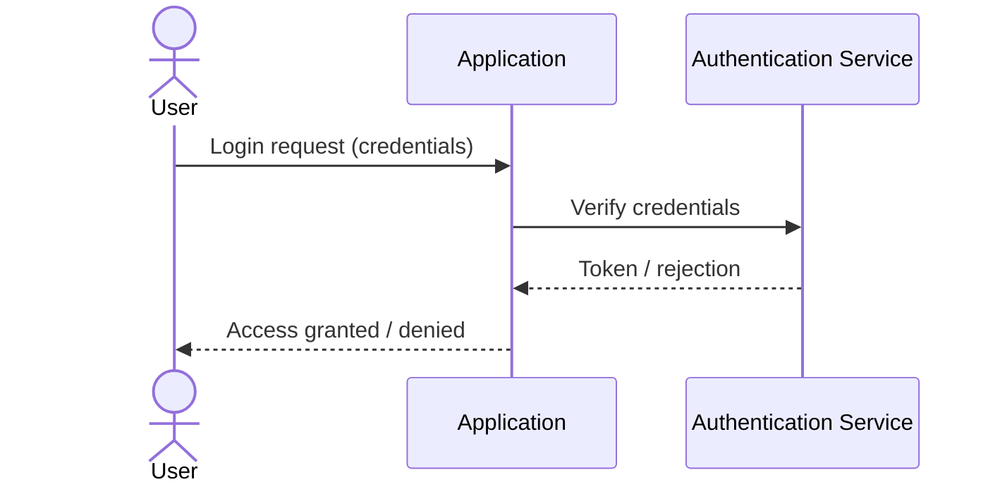

# Software Architecture Document

## Table of Contents

> [!NOTE]
> Update this table of contents to reflect the sections in this document.
>      In the MkDocs web view, the table of contents is generated automatically in the sidebar.
>      This section is intended for printed or exported (PDF) versions of the document.
>
> 1. IDENTIFICATION
>    1.1 Document Overview
>    1.2 Abbreviations and Glossary
>    1.3 References
>    1.4 Conventions
> 2. ARCHITECTURE OVERVIEW
> 3. HARDWARE ARCHITECTURE
>    3.1 Hardware Architecture Overview
>    3.2 Hardware Component 1
>    3.3 Hardware Component 2
>    3.4 Hardware Component 3
> 4. SOFTWARE ARCHITECTURE
>    4.1 Software Architecture Overview
>    4.2 Software Component 1
>    4.3 Software Component 2
>    4.4 Software Component 3
> 5. GRAPHICAL USER INTERFACE ARCHITECTURE
>    5.1 GUI Framework
>    5.2 GUI Component 1
>    5.3 GUI Component 2
> 6. SECURITY ARCHITECTURE
>    6.1 Data Flow Diagrams
>    6.2 Other Secure Architecture Views
> 7. SOUP AND SUPPORTED SOFTWARE
>    7.1 SOUP
>    7.2 Supported Software
> 8. DYNAMIC BEHAVIOR OF ARCHITECTURE
>    8.1 GUI Workflow / Sequence 1
>    8.2 GUI Workflow / Sequence 2
>    8.3 Workflow / Sequence 1
>    8.4 Workflow / Sequence 2
>    8.5 Security Use Case 1
>    8.6 Security Use Case 2
> 9. JUSTIFICATION OF ARCHITECTURE
>    9.1 System Architecture Capabilities
>    9.2 Network Architecture Capabilities
>    9.3 Architecture for Security
>    9.4 Risk Analysis Outputs and Software Safety Class Segregation
>    9.5 Human Factors Engineering Outputs
>    9.6 Regulation on Personal Data
>    9.7 SOUP Integration
> 10. REQUIREMENTS TRACEABILITY

## 1. IDENTIFICATION

| Field | Value |
|---|---|
| Document ID | <!-- TODO: e.g. PRJ-SAD-001 --> |
| Title | Software Architecture Document |
| Version | <!-- TODO: e.g. 1.0 --> |
| Date | <!-- TODO: YYYY-MM-DD --> |
| Status | <!-- TODO: Draft / Under Review / Approved --> |

### 1.1 Document Overview

This document describes the architecture of XXX system.

It describes:

- A general description, global system view, of the system,
- The hardware architecture on which runs the software,
- The software architecture, layers and top-level components,
- The security architecture of software, with security views,
- The Graphical User Interface architecture,
- The justification of technical choices made,
- The traceability between the architecture and the system requirements.

This document covers the software system and software item levels of IEC 62304.

**Scope:** <!-- TODO: Describe the scope of this document, e.g. which software items or modules are covered. -->

**Intended audience:** <!-- TODO: e.g. Software architects, software developers, quality managers, regulatory affairs. -->

--8<-- "snippets/glossary-and-references.md"

> [!NOTE]
> **Additional conventions**
> COTS, OTSS and SOUP don't refer to the same concept, i.e. software delivered by 3rd party that wasn't developed with a regulatory and/or normative compliant development process.
> We deliberately use the term "SOUP", to focus on IEC 62304 compliance.
>
> COTS and OTSS refer to software present at runtime or not. E.g.: SW dev tools are COTS or OTSS. Libraries incorporated in the released SW are COTS or OTSS.
>
> SOUP are only present at runtime: SW dev tools are NOT SOUP. Libraries incorporated in the released SW are SOUP.
>
> For IEC 81001-5-1 compliance, we consider SOUP and maintained software equivalent. Supported software is not SOUP.

## 2. Architecture Overview

> [!TIP]
> Give a general description of the system, with information relevant to the design team:
>
> - In what environment it works (home, near patient bed, operating room …)
> - Who the users are
> - What it is for
> - The main functions
> - The main interfaces, inputs and outputs
> - The main components or packages
>
> If your software is integrated in a larger system, you may reference a document that describes this system. Or you may describe it here, to document what is medical device and what is not.
> This is especially important for a SaMD integrated within a larger health software system not qualified as MD.
>
> Add a global view of your system, usually called architectural design chart or global system view.

> [!NOTE]
> Describe the system from the design team's point of view. Add a global system view diagram. Example:

## 3. Hardware Architecture

### 3.1 Hardware Architecture Overview

> [!TIP]
> If relevant, describe the hardware components on which software runs and their interactions/relationships.
> Use components diagrams, deployment diagrams, network diagrams, interface diagrams…
>
> For cloud-based software, this section may not be relevant.
> This may not be relevant for SaMD, or may be replaced by a deployment architecture.

> [!NOTE]
> Add a diagram showing the hardware architecture, if applicable. Example:

### 3.2 Hardware Component 1

> [!NOTE]
> This section is optional. You may not need it if your software is not Class C according to IEC 62304.

> [!NOTE]
> Describe the hardware component. The description shall contain:
> - Its identification
> - The purpose of the component
> - The software component it receives
> - Its technical characteristics: type of machine, CPU, RAM, disk and so on.
> - Its network hardware interfaces

| Field | Value |
|---|---|
| Identification | <!-- TODO --> |
| Purpose | <!-- TODO --> |
| Software hosted | <!-- TODO --> |
| Type of machine | <!-- TODO --> |
| CPU | <!-- TODO --> |
| RAM | <!-- TODO --> |
| Disk | <!-- TODO --> |
| Network hardware interfaces | <!-- TODO --> |

### 3.3 Hardware Component 2

> [!TIP]
> Repeat the pattern for each top-level component.

> [!NOTE]
> Describe the hardware component.

| Field | Value |
|---|---|
| Identification | <!-- TODO --> |
| Purpose | <!-- TODO --> |
| Software hosted | <!-- TODO --> |
| Type of machine | <!-- TODO --> |
| CPU | <!-- TODO --> |
| RAM | <!-- TODO --> |
| Disk | <!-- TODO --> |
| Network hardware interfaces | <!-- TODO --> |

### 3.4 Hardware Component 3

> [!TIP]
> Repeat the pattern for each top-level component.

> [!NOTE]
> Describe the hardware component.

| Field | Value |
|---|---|
| Identification | <!-- TODO --> |
| Purpose | <!-- TODO --> |
| Software hosted | <!-- TODO --> |
| Type of machine | <!-- TODO --> |
| CPU | <!-- TODO --> |
| RAM | <!-- TODO --> |
| Disk | <!-- TODO --> |
| Network hardware interfaces | <!-- TODO --> |

## 4. Software Architecture

### 4.1 Software Architecture Overview

> [!TIP]
> Describe the top-level software components and their interactions/relationships.
> The description goes further in details, compared to the global system view.
>
> Use UML package diagrams and/or layer diagrams and/or interface diagrams or any other architecture modelling convention.
>
> Describe also the operating systems or containerization system on which the software runs.
> Even if your software is in class A, this is required to answer to IEC 81001-5-1 requirements on architectural design.
>
> If your software interfaces deserve to be documented in details, you can also use the Interface Requirement Specification – Interface Design Specification template. DICOM or HL7 interfaces would be good candidates for such separate document.

> [!NOTE]
> Add a diagram showing the software architecture. Example:

### 4.2 Software Component 1

> [!NOTE]
> This section is optional. You may skip it for one of two reasons:
>
> 1. Your software is Class A according to IEC 62304.
> 2. You describe each top-level component in a dedicated Software Design Document (SDD).

> [!NOTE]
> Describe the software component. The description should contain:
> - Its identification
> - The purpose of the component
> - Its interfaces with other components (either use the Interface Requirement Specification – Interface Design
>   Specification template or copy paste bribes of this template here if the interface doesn't deserve a separate document)
> - Its network interfaces
> - The hardware resources it uses, for example: average RAM usage, peak RAM usage and peak frequency
>   and duration, disk space for permanent data, disk space for cache data, average CPU usage, peak CPU
>   usage and peak frequency and duration …

| Field | Value |
|---|---|
| Identification | <!-- TODO --> |
| Purpose | <!-- TODO --> |
| Interfaces with other components | <!-- TODO --> |
| Network interfaces | <!-- TODO --> |
| Average RAM usage | <!-- TODO --> |
| Peak RAM usage | <!-- TODO --> |
| Disk space (permanent data) | <!-- TODO --> |
| Disk space (cache data) | <!-- TODO --> |
| Average CPU usage | <!-- TODO --> |
| Peak CPU usage | <!-- TODO --> |

### 4.3 Software Component 2

> [!TIP]
> Repeat the pattern for each top-level component.

> [!NOTE]
> Describe the software component.

| Field | Value |
|---|---|
| Identification | <!-- TODO --> |
| Purpose | <!-- TODO --> |
| Interfaces with other components | <!-- TODO --> |
| Network interfaces | <!-- TODO --> |
| Average RAM usage | <!-- TODO --> |
| Peak RAM usage | <!-- TODO --> |
| Disk space (permanent data) | <!-- TODO --> |
| Disk space (cache data) | <!-- TODO --> |
| Average CPU usage | <!-- TODO --> |
| Peak CPU usage | <!-- TODO --> |

### 4.4 Software Component 3

> [!TIP]
> Repeat the pattern for each top-level component.

> [!NOTE]
> Describe the software component.

| Field | Value |
|---|---|
| Identification | <!-- TODO --> |
| Purpose | <!-- TODO --> |
| Interfaces with other components | <!-- TODO --> |
| Network interfaces | <!-- TODO --> |
| Average RAM usage | <!-- TODO --> |
| Peak RAM usage | <!-- TODO --> |
| Disk space (permanent data) | <!-- TODO --> |
| Disk space (cache data) | <!-- TODO --> |
| Average CPU usage | <!-- TODO --> |
| Peak CPU usage | <!-- TODO --> |

## 5. Graphical User Interface Architecture

> [!TIP]
> This section can be removed if you prefer having GUI components in the Software architecture, like other components — or if your software doesn't have a GUI.

### 5.1 GUI Framework

> [!TIP]
> As an introduction to GUI, you can explain what kind of architecture (MVC, MVP, MVVM, …) and/or GUI framework you used.

> [!NOTE]
> Describe the GUI architecture pattern and framework used.

### 5.2 GUI Component 1

> [!TIP]
> You can either describe the GUI components here or add them to the software architecture section above.

> [!NOTE]
> Describe the GUI component.

### 5.3 GUI Component 2

> [!TIP]
> You can either describe the GUI components here or add them to the software architecture section above.

> [!NOTE]
> Describe the GUI component.

## 6. Security Architecture

> [!NOTE]
> **IEC 81001-5-1 / FDA**
> This section is required, even for IEC 62304 Class A software.
> Add here views and comments explaining:
>
> - How the assets are protected within the architecture
> - How the defense in depth principle is applied
> - How software interfaces are secured
>
> You can use the recommendations found in Appendix 2 — *Submission Documentation for Security Architecture Flows* of the FDA Guidance on Cybersecurity in Medical Devices: Quality System Considerations and Content of Premarket Submissions.

### 6.1 Data Flow Diagrams

> [!TIP]
> Document assets, trust boundaries, interfaces of the device externally accessible and, if possible, interfaces from connected third-party software accessing your interfaces. You may use data flow diagrams for this purpose.

> [!NOTE]
> Add data flow diagrams showing assets, trust boundaries, and externally accessible interfaces. Example:

### 6.2 Other Secure Architecture Views

> [!TIP]
> Add here the views required by the FDA Cybersecurity Guidance:
>
> - **Global System View** (this can already be present in §2 of this document)
> - **Multi-Patient Harm View**
> - **Updatability / Patchability View**
> - **Security Use Case Views** (can alternatively be documented in §8 below)
>
> Have a closer look at Appendix 2.B of FDA Guidance on Cybersecurity in Medical Devices: Quality System Considerations and Content of Premarket Submissions.

> [!NOTE]
> Add the required security architecture views.

## 7. SOUP and Supported Software

### 7.1 SOUP

> [!NOTE]
> **IEC 62304**
> If you use SOUP (Software Of Unknown Provenance), list them here. You can also present the bullet points below as columns in a table with one line for each SOUP.
> For each SOUP, describe:
>
> - Its identification and version
> - Its purpose
> - Where it comes from: manufacturer, vendor, university …
> - Whether it is maintained by a third party or not
> - If this is an executable:
>     - What hardware / software resources it uses
>     - Whether it is insulated in the architecture and why
> - Its interfaces and data flows
> - Which SOUP functions/API the software uses
> - How the SOUP is integrated in the software
> - What hardware/software resources it requires for proper use
> - Where to get the bugs / updates / security issues

> [!NOTE]
> **FDA Guidance**
> Have a look at FDA Guidance "Off-The-Shelf Software Use in Medical Devices" to determine if you need specific or special documentation for your SOUP.
>
> If there is a list of known bugs for your SOUP, you may add here this list with a review of their consequences in terms of software failure and patient safety. If there are concerns about known bugs, they should be treated by the risk management process.

> [!NOTE]
> Add one sub-section per SOUP item.

#### 7.1.1 SOUP Item 1

| Field | Value |
|---|---|
| Identification | <!-- TODO: Name and version, e.g. OpenSSL 3.1.0 --> |
| Purpose | <!-- TODO: Why this SOUP is used in the software --> |
| Origin | <!-- TODO: Manufacturer / vendor / university … --> |
| Maintained by third party | <!-- TODO: Yes / No --> |
| Type | <!-- TODO: Library / Executable / Operating System / … --> |
| Hardware/software resources used (if executable) | <!-- TODO --> |
| Insulated in architecture (if executable) | <!-- TODO: Yes / No — explain why --> |
| Interfaces and data flows | <!-- TODO --> |
| SOUP functions/API used | <!-- TODO: List the specific functions or APIs used --> |
| Integration in software | <!-- TODO: Describe how the SOUP is integrated --> |
| Hardware/software requirements for proper use | <!-- TODO --> |
| Source for bugs / updates / security issues | <!-- TODO: e.g. CVE database, vendor security advisories … --> |

> [!NOTE]
> Add a sub-section for each additional SOUP item.

### 7.2 Supported Software

> [!NOTE]
> **IEC 81001-5-1**
> If your software needs supported software (see IEC 81001-5-1), list them here. You can also present them in a table.
> For each supported software, describe:
>
> - Its identification and version
> - Its purpose
> - Its manufacturer, vendor, university …
>
> Note: contrary to SOUP, supported software isn't incorporated (see definition of SOUP) in your medical device. Rule of thumb: if you don't deliver a software but it is present in your installation prerequisites and provided by the user / client organisation, it's probably a supported software. Consequence: supported software is hardly present in embedded software architecture.

> [!NOTE]
> List supported software items, if applicable.

| Identification | Version | Purpose | Manufacturer / Vendor |
|---|---|---|---|
| PostgreSQL | 15.x | Relational database management system for patient record storage | PostgreSQL Global Development Group |
| <!-- TODO --> | <!-- TODO --> | <!-- TODO --> | <!-- TODO --> |

## 8. Dynamic Behavior of Architecture

> [!TIP]
> The architecture was designed to answer to functional requirements.
> For each main function of the system, add a description of the sequences / data flow that occur.
> Use sequence diagrams, collaboration diagrams, …
>
> Don't forget workflows with third parties but also with your other — non-medical device — software, like server publishing updates, maintenance application, …

### 8.1 GUI Workflow / Sequence 1

> [!TIP]
> Describe here the workflow / sequence of GUI actions.
> This workflow could come from a UX design tool. Then reference the document output from this tool or copy-paste it here.

> [!NOTE]
> Describe the GUI workflow / sequence. Add a diagram.

### 8.2 GUI Workflow / Sequence 2

> [!TIP]
> Describe here the workflow / sequence of GUI actions.
> This workflow could come from a UX design tool. Then reference the document output from this tool or copy-paste it here.

> [!NOTE]
> Describe the GUI workflow / sequence. Add a diagram.

### 8.3 Workflow / Sequence 1

> [!TIP]
> Most workflows involve GUI. Some may not, like on the server-side.
> Describe here the workflow / sequence of a main function.
> For example, the user queries data, what happens, from his terminal to the database.

> [!NOTE]
> Describe the workflow / sequence. Add a diagram. Example:

### 8.4 Workflow / Sequence 2

> [!TIP]
> Repeat the pattern for each main function of the system.

> [!NOTE]
> Describe the workflow / sequence. Add a diagram.

### 8.5 Security Use Case 1

> [!TIP]
> Describe here the workflow / sequence of a security function.
> For example, the user wants to log in, what happens, from the login prompt to the verification of security credentials.

> [!NOTE]
> Describe the security use case. Add a diagram.

### 8.6 Security Use Case 2

> [!TIP]
> Repeat the pattern for each security function of the system.

> [!NOTE]
> Describe the security use case. Add a diagram.

## 9. Justification of Architecture

### 9.1 System Architecture Capabilities

> [!TIP]
> Describe here the rationale of the hardware / software architecture in terms of capabilities:
>
> - **Performance** — response time, user mobility, data storage, or any functional performance which has an impact on architecture
> - **User / patient safety** (see §9.4 and §9.5)
> - **Protection against misuse** (see §9.5)
> - **Maintenance** (cold maintenance or hot maintenance)
> - **Adaptability, flexibility**
> - **Scalability, availability**
> - **Backup and restore**
> - **Fault tolerance, redundancy, emergency stop, recovery after crash …**
> - **Administration**
> - **Monitoring**
> - **Audit and audit logs**
> - **Internationalization**
> - **Decommissioning**
>
> The table below gives typical examples per platform type; keep only the rows relevant to your project.

| Capability | Firmware (embedded) | Standalone PC app | Web app (client-side) | Cloud server | Mobile app |
|---|---|---|---|---|---|
| Performance | Real-time constraints, interrupt latency, watchdog timers | Response time on minimum hardware config | Page load time, rendering performance | Throughput, API response time, autoscaling | Response time on minimum supported device, battery impact |
| Maintenance | Firmware update over JTAG or OTA; field replacement of modules | Installer / update bundle; cold restart | Hot deployment, zero-downtime update | Rolling deployment, blue-green; no patient impact | App store update; forced vs. optional update |
| Fault tolerance | Hardware watchdog, safe state on crash, power-fail recovery | Crash reporter, auto-restart service | Graceful degradation, offline mode | Redundancy, load balancing, circuit breakers | Auto-resume after OS kill, local data persistence |
| Scalability | Fixed hardware resources; firmware footprint minimisation | Single-user; footprint on local disk | Session management, CDN, caching | Horizontal / vertical scaling, microservices | Device storage limits, background process limits |
| Backup & restore | Non-volatile storage, factory reset procedure | Local export, configuration backup | Browser storage limits; server-side backup of user data | Database replication, automated snapshots, disaster recovery | Cloud sync; local data export before uninstall |
| Administration | Serial console, hardware debug port | Local admin account, config file | Admin portal, user management | DevOps pipeline, infrastructure-as-code, secrets management | MDM / enterprise deployment; remote wipe |
| Audit & logs | Ring buffer on flash, log upload at maintenance | Local log file, exportable audit trail | Client-side event log sent to server | Centralised log aggregation (SIEM), tamper-evident audit trail | On-device log with upload on sync |
| Internationalization | Locale stored in firmware config | Resource files / gettext; locale switching | i18n framework (e.g. i18next); RTL support | Server-side locale rendering; API response language | OS locale detection; app-level language override |
| Decommissioning | Secure erase of flash; hardware disposal | Uninstaller with data wipe | Account deletion; GDPR right to erasure | Data retention policy; tenant off-boarding | App uninstall data cleanup; remote account deletion |

> [!NOTE]
> Describe the rationale of the architecture for each applicable capability.

### 9.2 Network Architecture Capabilities

> [!TIP]
> If the medical device uses/has a network, describe here the rationale of the hardware / network architecture:
>
> - Bandwidth
> - Network failures
> - Loss of data
> - Inconsistent data
> - Inconsistent timing of data
> - Network security (if not described below)

> [!NOTE]
> Describe the rationale of the network architecture, if applicable.

### 9.3 Architecture for Security

> [!NOTE]
> **IEC 81001-5-1 / FDA**
> Explain in this section the decisions taken to secure the architecture:
>
> - **Defense in depth architecture:** how security requirements are assigned to each layer of defense. You may reference the security traceability matrix at the bottom of the document.
> - **Secure design best practices:** least privileges, economy of mechanisms, secure design patterns…
> - **Segregation of software items** between trust boundaries.

> [!NOTE]
> Describe the security architectural decisions taken.

### 9.4 Risk Analysis Outputs and Software Safety Class Segregation

> [!TIP]
> If the results of risk analysis have an impact on the architecture, describe here for each risk analysis output what has been done to mitigate the risk in the architecture.
> Especially software segregation between high-risk SW and lower-risk SW.
> This is required if you have software sub-system in Class C and other sub-systems in lower classes.

> [!TIP]
> Use diagrams if necessary, like architecture before risk mitigation (e.g. without segregation) and architecture after risk mitigation (e.g. with segregation), to explain the choices.

> [!NOTE]
> For each relevant risk analysis output, describe the architectural mitigation applied.

| Risk | Architectural Mitigation | Comment |
|---|---|---|
| Incorrect result delivered by algorithm treatment module | Control check in the output validation module | Output validation module is placed in a separate process, isolated from treatment module |
| <!-- TODO: Risk description --> | <!-- TODO: Mitigation in architecture --> | <!-- TODO --> |

### 9.5 Human Factors Engineering Outputs

> [!TIP]
> If (by any chance) the results of human factors analysis have an impact on the architecture, describe here for each risk output what has been done to mitigate the risk in the architecture.
> This is very unlikely. Remove this section if not relevant.

> [!NOTE]
> For each relevant human factors output, describe the architectural mitigation applied, if applicable.

| Human Factors Finding | Architectural Mitigation | Comment |
|---|---|---|
| <!-- TODO: Finding description --> | <!-- TODO: Mitigation in architecture --> | <!-- TODO --> |

### 9.6 Regulation on Personal Data

> [!TIP]
> If HIPAA or EU Regulation 2016/679 (GDPR) are applicable, and if relevant, describe here how the architecture is compliant to these regulations. For GDPR, see articles 25 and 32.

> [!NOTE]
> Describe how the architecture addresses applicable personal data regulations, if applicable.

### 9.7 SOUP Integration

> [!TIP]
> If the software architecture has a particular structure dedicated to SOUP integration, it can be described here. For example, a wrapper of the SOUP, or an external process + a socket communication, …

> [!NOTE]
> Describe any specific architectural patterns used for SOUP integration, if applicable.

## 10. Requirements Traceability

### 10.1 Software Requirements

> [!TIP]
> This may be a difficult job. A high-level function is usually handled by many components. In this case, quote only the component(s) which has(have) the major role.

> [!NOTE]
> **IEC 62304 / FDA**
> This traceability is not required by IEC 62304 and is only suggested in the note found in section 5.3.6. However, it is warmly recommended for Class C software. It is also recommended in FDA Guidance on Content of Premarket Submissions for Device Software Functions.

> [!NOTE]
> Add rows for all software requirements.

| Requirement | Component | Comment |
|---|---|---|
| REQ-001 The device shall do foo | COMPO-001: foo maker | COMP-001 does foo. |
| REQ-001 The device shall do foo | COMPO-002: foo checker | COMP-002 verifies foo result. |
| <!-- TODO: Requirement ID and description --> | <!-- TODO: Component ID and name --> | <!-- TODO --> |

### 10.2 Software Security Requirements

> [!NOTE]
> **IEC 81001-5-1**
> This traceability matrix at architecture level is a way to address IEC 81001-5-1 requirements about secure architecture, for requirements related to cybersecurity only.
>
> A similar table should be present in hardware design documentation if security requirements are implemented at hardware level.

> [!NOTE]
> Add rows for all software security requirements.

| Requirement | Component | Comment |
|---|---|---|
| REQ-SEC-001 The device shall verify foo data authenticity | COMPO-003: foo data authentication | COMP-003 manages authentication of foo data. |
| REQ-SEC-002 The device shall verify foo data integrity | COMPO-003: foo data integrity | COMP-003 manages integrity verification of foo data. |
| <!-- TODO: Requirement ID and description --> | <!-- TODO: Component ID and name --> | <!-- TODO --> |
