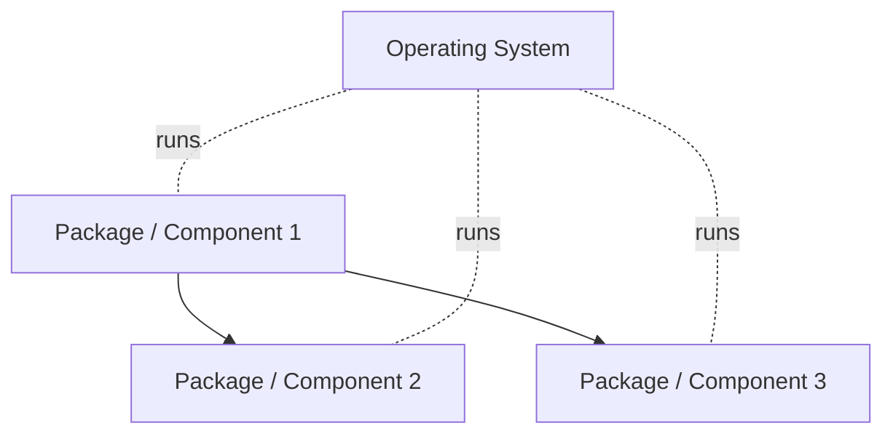
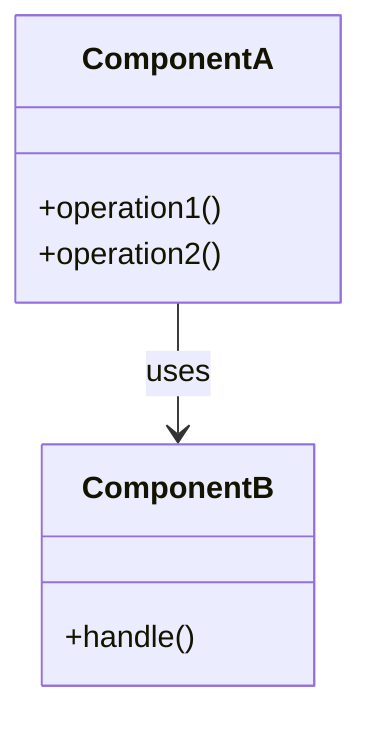
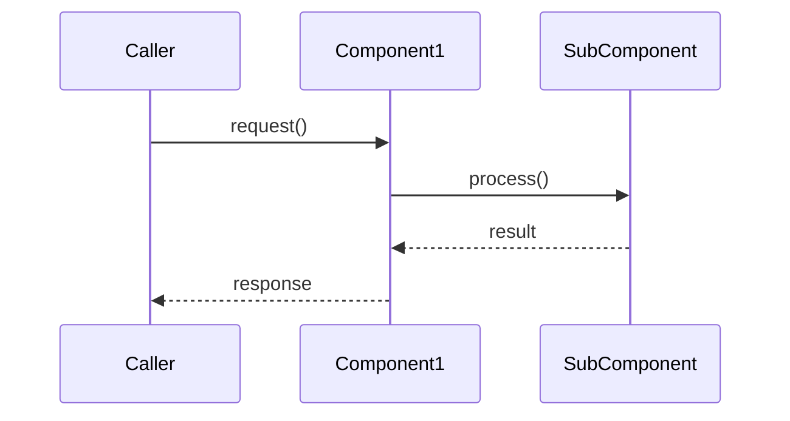

# Software Design Specification

## Table of Contents

> [!NOTE]
> Update this table of contents to reflect the sections in this document.
>      In the MkDocs web view, the table of contents is generated automatically in the sidebar.
>      This section is intended for printed or exported (PDF) versions of the document.
>
> 1. IDENTIFICATION
>    1.1 Document Overview
>    1.2 Abbreviations and Glossary
>    1.3 References
>    1.4 Conventions
> 2. SOFTWARE ARCHITECTURE OVERVIEW
> 3. SOFTWARE DESIGN SPECIFICATION
>    3.1 Component 1
>       3.1.1 Component design description
>       3.1.2 Workflows and algorithms
>       3.1.3 Component interfaces
>       3.1.4 Component secure design description
>       3.1.5 Component interfaces secure design
>       3.1.6 Software requirements mapping
>    3.2 Component 2
>    3.3 Component 3
> 4. SOUP IDENTIFICATION
> 5. CRITICAL REQUIREMENTS

## 1. IDENTIFICATION

| Field | Value |
|---|---|
| Document ID | <!-- TODO: e.g. PRJ-SDD-001 --> |
| Title | Software Design Specification |
| Version | <!-- TODO: e.g. 1.0 --> |
| Date | <!-- TODO: YYYY-MM-DD --> |
| Status | <!-- TODO: Draft / Under Review / Approved --> |

### 1.1 Document Overview

> [!NOTE]
> **Single instance or multiple instances**
> You may have all the design description of your software:
>
> - Either in a **single instance** of this document
> - Or have the design specification of each component/package/element in **many instances** of this document.
>
> This is your choice, which depends on the size of your software.

This document describes the detailed design specifications of <!-- TODO: XXX component/package/element --> of <!-- TODO: XXX device -->, part of <!-- TODO: XXX --> software development project.

This document covers the software unit level of IEC 62304.

**Scope:** <!-- TODO: Describe the scope of this document, e.g. which components or modules are covered. -->

**Intended audience:** <!-- TODO: e.g. Software architects, software developers, quality managers, regulatory affairs. -->

--8<-- "snippets/glossary-and-references.md"

## 2. Software Architecture Overview

> [!TIP]
> Either reference the architecture document, or describe here the top-level software components that are the subject of this detailed design specification.
>
> Use UML package diagrams and/or layer diagrams and/or interface diagrams.
>
> Describe also the operating systems on which the software runs.
>
> You may reference the Software Architecture Document, if you have one in your project, which already explains the software architecture.

> [!NOTE]
> Either reference the Software Architecture Document (e.g. PRJ-SAD-001) or describe the top-level software components here. Example diagram:

## 3. Software Design Specification

> [!NOTE]
> **Structure of this section**
> If you have a **single design specification document**, describe each top-level package/component of your software, and if necessary sub-components/sub-packages:
>
> - Top-level component #1 → described in section 3.1
>     - Sub-component #1 → described in section 3.1.1
>     - Sub-component #2 → described in section 3.1.2
>     - And so on…
> - Top-level component #2 → described in section 3.2
> - Top-level component #3 → described in section 3.3
>
> If you decide to have **one design document per top-level package/component**, describe the content (sub-components, sub-packages) of the top-level package/component covered by this instance. The top-level components shall be described in the Software Architecture Document.
>
> - Top-level component #1 → described in instance #1 of SDD
>     - Sub-component #1 → described in section 3.1
>     - Sub-component #2 → described in section 3.2
>     - And so on…
> - Top-level component #2 → described in instance #2 of SDD
> - Top-level component #3 → described in instance #3 of SDD
>
> Use class diagrams, collaboration/sequence diagrams, and deployment diagrams to illustrate your description.

### 3.1 Component 1

> [!TIP]
> Describe the component with the structure relevant to the technology you use.
> The sub-sections below give examples of topics to address.
> If you are in Class C, refer to section 5.5.4 of IEC 62304.

> [!NOTE]
> Replace "Component 1" with the actual component name/identifier.

#### 3.1.1 Component design description

> [!TIP]
> Describe the design of the component. Use package diagrams and/or class diagrams to show the links between sub-components/sub-packages and/or classes inside the component.
>
> For example, explain:
>
> - How the component implements Software Requirements Specification (SRS) requirements,
> - Algorithms or control logic implemented for medical-related functions (therapy, diagnosis, monitoring) and more technical functions (data storage, hardware event handling, GUI event handling),
> - Data processing and manipulation methods,
> - How the GUI is designed, e.g. with the use of frameworks for GUI or otherwise,
> - Support for multiple languages,
> - Interactions and dependencies with other components,
> - Design patterns or architectural styles used,
> - Scalability and extensibility considerations.

> [!NOTE]
> Describe the design of the component. Add package/class diagrams as needed. Example:

#### 3.1.2 Workflows and algorithms

> [!TIP]
> Use collaboration diagrams and/or sequence diagrams to show the workflows of components/packages/classes inside the component.
>
> Describe algorithms where possible. An algorithm may be described outside this document — in that case, add the reference to that document.

> [!NOTE]
> Describe the workflows and algorithms. Add sequence/collaboration diagrams as needed. Example:

#### 3.1.3 Component interfaces

> [!TIP]
> Describe the interfaces of the component and their input/output data.

**Functionality:**

> [!NOTE]
> Describe the interface's purpose and functions.

**Input / Output:**

> [!NOTE]
> Describe:
> - Data inputs and their formats
> - Data outputs and their formats
> - Who supplies the inputs and receives the outputs
> - Protocols and methods used for data exchange

| Direction | Data | Format | Counterpart |
|---|---|---|---|
| Input | <!-- TODO --> | <!-- TODO --> | <!-- TODO --> |
| Output | <!-- TODO --> | <!-- TODO --> | <!-- TODO --> |

**Performance:**

> [!NOTE]
> Describe speed and timing requirements, data throughput expectations.

**Error Handling:**

> [!NOTE]
> Describe how the interface handles and reports errors, including error codes and messages.

**Use of COTS/SOUP:**

> [!NOTE]
> List any COTS/SOUP used in this interface, if applicable.

#### 3.1.4 Component secure design description

> [!NOTE]
> **IEC 81001-5-1**
> The implementation of security requirements by a component shall be detailed in this section. This is required if security features need to be documented at the detailed design level, such as the proper implementation of secured external software interfaces.

> [!NOTE]
> Describe how the component implements security requirements, if applicable.

#### 3.1.5 Component interfaces secure design

> [!NOTE]
> **IEC 81001-5-1**
> The way component interfaces are designed in a secure manner shall be detailed in this section.
>
> Describe, when applicable:
>
> - Whether the interface is externally (outside the device) or internally accessible, and whether access to the interface is possible across a trust boundary.
> - Security implications of access to an external interface in the intended environment of use:
>     - Who has legitimate access,
>     - What are applicable threats,
>     - What is the likelihood of illegitimate access (see cyber risk management).
> - Potential users and assets accessed, e.g.:
>     - All users to some non-critical assets, users with privileges to other — more critical — assets,
>     - Software (non-human) user accounts, like default operating system user accounts with privileges.
> - Possible constraints, e.g.: unsecure access to legacy software or system.
> - The use of COTS/SOUP.
>
> The consequence in terms of secure design and device hardening, to secure legitimate accesses to the interface and protect the interface from illegitimate accesses:
>
> - User roles, privileges, access control permissions,
> - Security capabilities, e.g.: authentication, authorization, data privacy, data encryption, data integrity, code execution integrity, event detection and logging,
> - Compensating measures:
>     - Usually, compensating measures are outside detailed design (e.g. using a firewall) — in that case, reference the compensating measure and the document specifying it,
>     - But all cases are possible and compensating measures may be defined at the detailed design level.
> - Documentation on how to use the interface if it is externally accessible:
>     - Reference the documentation or reference the SRS containing the documentation specification (see SRS document template).

> [!NOTE]
> Describe the secure design of the component's interfaces, if applicable.

#### 3.1.6 Software requirements mapping

> [!NOTE]
> **IEC 62304 / IEC 81001-5-1**
> For **Class C software only**: list the SRS requirements handled by this component and its interfaces.
>
> Additionally, **for all classes**: list the secure software requirements handled by this component.
>
> Note: this traceability matrix at the detailed design level is a way to address IEC 81001-5-1 section 5.5.2 on software unit implementation, for requirements related to cybersecurity only.

> [!NOTE]
> Add rows for all requirements handled by this component.

| Requirement | Component | Comment |
|---|---|---|
| REQ-SEC-001 The device shall authenticate foo data | SUBCOMPO-003-AUTH: foo data authentication | SUBCOMP-003 manages authentication of foo data. |
| <!-- TODO: Requirement ID and description --> | <!-- TODO: Component ID and name --> | <!-- TODO --> |

### 3.2 Component 2

> [!TIP]
> Repeat the pattern of section 3.1 for each component. Add sub-sections 3.2.1 through 3.2.6 as needed.

> [!NOTE]
> Describe Component 2, following the same sub-section structure as section 3.1.

### 3.3 Component 3

> [!TIP]
> Repeat the pattern of section 3.1 for each component. Add sub-sections 3.3.1 through 3.3.6 as needed.

> [!NOTE]
> Describe Component 3, following the same sub-section structure as section 3.1.

## 4. SOUP Identification

> [!NOTE]
> **IEC 62304 **
> Add the list of SOUP used in this software detailed design specification, if the architectural level is too high to list all SOUPs.
>
> For each SOUP, provide: identification (name, version), download URL, license type, and requirements traceability.
>
> **Caution:** if SRS requirements are handled by SOUP, traceability between the SOUP and the SRS requirements shall be described here.

> [!NOTE]
> List SOUP libraries used in this component/software. Example:

SOUP libraries used in <!-- TODO: XXX --> are the following:

| SOUP | Version | Download URL | License | Requirements traceability |
|---|---|---|---|---|
| foo.jar / foo.so / foo.dll | <!-- TODO: version id --> | <!-- TODO: download URL --> | <!-- TODO: license type --> | <!-- TODO: e.g. REQ-001, REQ-002 --> |
| bar.jar / bar.so / bar.dll | <!-- TODO: version id --> | <!-- TODO: download URL --> | <!-- TODO: license type --> | <!-- TODO: e.g. REQ-003 --> |

## 5. Critical Requirements

> [!NOTE]
> **Optional**
> This section is optional.
>
> If requirements were tagged as critical in the SRS (e.g. requirements added after risk analysis), add here the traceability between these requirements and the components described in this document.

> [!NOTE]
> Add rows for all critical requirements, if applicable.

| Requirement ID | Requirement Title | Component | Comment |
|---|---|---|---|
| REQ-001 | Software shall have an abort button | Main window | Widget added in the window layout. |
| ^ | ^ | Main window controller | Controller aborts the operation. |
| <!-- TODO: Requirement ID --> | <!-- TODO: Requirement title --> | <!-- TODO: Component --> | <!-- TODO --> |
