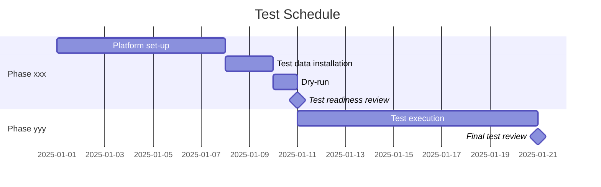

# Software Test Plan

## Table of Contents

> [!NOTE]
> Update this table of contents to reflect the sections in this document.
>      In the MkDocs web view, the table of contents is generated automatically in the sidebar.
>      This section is intended for printed or exported (PDF) versions of the document.
>
> 1. IDENTIFICATION
>    1.1 Document Overview
>    1.2 Abbreviations and Glossary
>    1.3 References
>    1.4 Conventions
> 2. TEST ENVIRONMENT
>    2.1 Integration and Factory Test Site
>       2.1.1 Hardware Test Platform
>       2.1.2 Software Test Tools
>       2.1.3 Security Test Tools
>       2.1.4 Test Data and Documentation
>       2.1.5 Other Test Materials
>       2.1.6 Installation, Set-up, and Maintenance
>       2.1.7 Personnel
>       2.1.8 Test Platform Security and Privacy
>    2.2 Customer / Field Test Site
> 3. TESTS IDENTIFICATION
>    3.1 Testing Phases
>    3.2 Automated Unit Tests
>    3.3 Automated Integration and Verification Tests
>    3.4 Test Categories
>    3.5 Test Progression
>    3.6 Test Coverage
>    3.7 Data Recording, Post-Processing, and Analysis
>    3.8 Test Identification and Content
> 4. PLANNED TESTS
>    4.1 Tests Phase xxx
>       4.1.1 Tests Coverage
>       4.1.2 Planned Tests
> 5. TESTS SCHEDULES
> 6. VERIFICATION METHODS
> 7. REQUIREMENTS TRACEABILITY

## 1. IDENTIFICATION

| Field | Value |
|---|---|
| Document ID | <!-- TODO: e.g. PRJ-STP-001 --> |
| Title | Software Test Plan |
| Version | <!-- TODO: e.g. 1.0 --> |
| Date | <!-- TODO: YYYY-MM-DD --> |
| Status | <!-- TODO: Draft / Under Review / Approved --> |

### 1.1 Document Overview

This document is the Software Test Plan (STP) of the <!-- TODO: project name --> software development project. It contains the list of tests executed during the integration and verification phases of <!-- TODO: project name -->:

- Software Integration tests,
- Software Verification tests,
- Software Cybersecurity tests.

> [!NOTE]
> Some sections of this document concern the organization of tests and may already be described in the Project Management Plan. If so, reference the matching section in the Project Management Plan rather than duplicating the content here.

> [!NOTE]
> Integration and verification tests may be merged into a single phase. If so, adapt the document as appropriate.

> [!NOTE]
> Cybersecurity tests may also be merged with verification tests. However, penetration tests are performed by a team independent from the development, test, and QA teams. They are therefore documented in a separate Penetration Test Plan and Penetration Test Report, written by that independent team.

**Scope:** <!-- TODO: Describe the scope of this document, e.g. which software items, releases, or testing phases are covered. -->

**Intended audience:** <!-- TODO: e.g. Software engineers, QA engineers, project managers, regulatory reviewers. -->

--8<-- "snippets/glossary-and-references.md"

## 2. TEST ENVIRONMENT

This section describes the test environment from the point of view of organization and logistics. It is intended to ensure the smooth progress of tests on each test site.

> [!NOTE]
> The template below assumes two test sites: one in your offices (integration / factory) and one on the field (customer). Duplicate the sub-sections if there are more than two sites, or remove a sub-section if it is not applicable.

### 2.1 Integration and Factory Test Site

#### 2.1.1 Hardware Test Platform

> [!NOTE]
> Describe where the test platform is located and its opening hours if access is constrained.

> [!NOTE]
> If the platform has special infrastructure requirements (power supply, room temperature, air conditioning), describe them here — or reference the document where they are described.

> [!NOTE]
> **Virtualized or cloud infrastructure**
> If the platform uses virtualized or cloud infrastructure, the underlying hardware may still be relevant, especially for stress tests. Describe the hardware configuration if it affects test outcomes (number of CPUs, GPUs, RAM, SSD capacity, network bandwidth).
>
> Describe the frontend configuration:
>
> - PC,
> - Mobile (include sensor properties if relevant: camera, microphone, depth sensors, GPS, …),
> - Specific / embedded.

> [!NOTE]
> **On-premises platform**
> Identify all hardware items accurately:
>
> - Standard computers and servers: hardware configuration, processor, memory, hard disk, network connections, wireless capabilities (Wi-Fi, Bluetooth).
> - Specific hardware (hardware simulators, customer-supplied hardware, electronic cards, medical devices, …): purpose, name, manufacturer, configuration, version, firmware version, lot number, serial number, and any other relevant information.
> - Consumables: CD-ROMs, memory sticks, tapes, printer cartridges, paper, etc.

> [!NOTE]
> Optionally include a deployment diagram, network address plan, power supply plan, or room plan.

#### 2.1.2 Software Test Tools

> [!NOTE]
> Identify all software used for testing.

> [!NOTE]
> **Virtual infrastructure**
> Describe the software backend configuration: virtual machines, orchestrator, database, logging, analytics, scaling, etc.

> [!NOTE]
> **General software test tools**
> Identify and version all relevant items:
>
> - Operating systems and service packs,
> - OS drivers (if specific),
> - Backup / recovery tools,
> - Web servers, CMS, database engines,
> - Memory, disk, CPU, and network analysers,
> - Test coverage or test management tools,
> - Simulators or data generators for unavailable software or hardware,
> - Any custom test tooling developed in-house.
>
> These tools may be OS-provided utilities (df, du, ps, top, Task Manager, …), specialized tools (Wireshark, …), cloud services (test management SaaS), or commercial products.

> [!NOTE]
> Describe the bug repository tool and the process for collecting and tracking defects.

#### 2.1.3 Security Test Tools

> [!NOTE]
> List the tools used for security tests.

> [!NOTE]
> This list shall be consistent with the security testing strategy defined in the Project Management Plan or Software Development Plan. If the list is already present in one of those documents, add a reference here instead of duplicating it.

#### 2.1.4 Test Data and Documentation

> [!NOTE]
> Describe the datasets used during tests: their identification, structure, content, location, and storage.

Datasets may include:

- Input files,
- Data files,
- Scripts to generate data,
- Output files and log files.

> [!NOTE]
> Describe which documentation is delivered for the tests (e.g. Software Tests Description, Instructions for Use), whether it is printed or online, and where it is located.

#### 2.1.5 Other Test Materials

> [!NOTE]
> List any other physical or consumable materials required to conduct the tests
> e.g. paper in a specific format, stopwatch, ruler, calibration equipment, a Willy Waller 2006 or 2026.
> Also pizzas, bier, sodas... 

#### 2.1.6 Installation, Set-up, and Maintenance

> [!NOTE]
> Describe the installation and set-up of the test platform before use, if any steps are required beyond standard procedures.

> [!NOTE]
> Describe maintenance operations, including backup and restore procedures.

#### 2.1.7 Personnel

> [!NOTE]
> Describe the persons or professional profiles required to execute the tests, their number, and any special skills or qualifications needed.

#### 2.1.8 Test Platform Security and Privacy

> [!NOTE]
> Describe the security provisions protecting the test platform, if applicable:
>
> - Building security: access doors, badge systems,
> - Administrative security: access rights and authorizations,
> - Hardware security: firewalls, network isolation,
> - Software security measures,
> - Data privacy and personal data handling.
>
> This may alternatively be described in an Information Security Plan or in the Project Management Plan — reference those documents here if so.

### 2.2 Customer / Field Test Site

> [!NOTE]
> Repeat the pattern of §2.1 for the customer or field test site.
>
> If the product is tested in a healthcare centre, or if the customer is a medical device manufacturer, consider:
> - Hardware, software, data, and documentation that you provide to the customer,
> - Installation and maintenance activities at the customer site,
> - Constraints on opening hours and customer personnel qualifications.
>
> If tests are conducted with practitioners (e.g. members of a medical advisory board) in their offices, some sub-sections may not be relevant — focus on how test input/output data are managed and how test logs and bug reports are collected.

---

## 3. TESTS IDENTIFICATION

### 3.1 Testing Phases

This test plan defines all tests to verify the requirements of <!-- TODO: project name --> software in the following successive testing phases:

- Unit tests,
- Integration tests,
- Factory tests,
- Security tests,
- End-user / Customer tests.

> [!NOTE]
> Adapt this list to fit your software development project.

Requirements are defined in the Software Requirements Specification (SRS), ref <!-- TODO: SRS document ID -->.

### 3.2 Automated Unit Tests

> [!NOTE]
> **Optional section**
> Discard this section if automated unit tests are not used in this project.

Automated unit tests are run on the software development platform by the CI/CD tool.

> [!NOTE]
> Either describe here how and when these tests are run, or reference the Software Development Plan.

> [!NOTE]
> The purpose of this section is to describe the scheduling of automated unit tests when a build (nightly, non-stable, or stable) is triggered. Example: *every night, all automated unit tests are run using Jenkins; the automatic test results are sent to <!-- TODO: reviewer --> for review.*
>
> Automated unit test scheduling triggered by a developer push or merge to the repository should be described in the CI/CD section of the Software Development Plan.

> [!NOTE]
> Describe or reference the automated unit test scheduling.

### 3.3 Automated Integration and Verification Tests

> [!NOTE]
> **Optional section**
> Discard this section if automated integration and verification tests are not used in this project.

> [!NOTE]
> Describe the scheduling of automated tests on the test platform. Automated tests may run on a dedicated test platform instance.

### 3.4 Test Categories

> [!NOTE]
> **Optional section**
> Discard this section if test categories are not used in this project.

Tests are distributed into categories depending on their purpose:

- Risk mitigation tests,
- Human factors engineering tests,
- Main function tests,
- Response time tests,
- Data exchange tests,
- <!-- TODO: Add further categories as appropriate. -->

> [!WARNING]
> Always retain the risk mitigation test category — it is mandatory.

### 3.5 Test Progression

> [!NOTE]
> **Optional section**
> Discard this section if test progression is linear and requires no specific rationale.

The test progression depends on the testing phase:

- **Unit tests:** the testing tool automatically determines the test progression. There are no dependencies between unit tests.
- **Integration tests:** tests are executed according to the following rationale:
    - Integration with interface A alone,
    - Integration with interface B alone,
    - Integration with interfaces A and B together.
- **Factory tests:** test progression is defined as follows:
    - Inspection tests are performed first,
    - Tests in category <!-- TODO: xxx --> are performed afterwards.

> [!NOTE]
> Continue the list above as appropriate for additional test categories in your project.
- **End-user tests:** test progression follows the operational scenarios.

> [!NOTE]
> Replace the example above with the rationale that applies to your project.

### 3.6 Test Coverage

> [!NOTE]
> **Optional section**
> Discard this section if tests cover all software requirements in every phase without restriction.

Test coverage depends on the testing phase:

- Automated tests cover all components of <!-- TODO: project name --> software.
- Integration tests cover all interface requirements of <!-- TODO: project name --> software.
- Alpha tests cover all requirements defined in the SRS, except <!-- TODO: list exclusions -->.
- Beta tests cover all requirements defined in the SRS.
- First Release Candidate (RC1) tests cover all requirements defined in the SRS.
- Subsequent Release Candidates (RCn) cover, at minimum, requirements impacted by the changes between RCn and RC(n−1), plus all risk mitigation tests and non-regression tests.

> [!NOTE]
> The traceability between tests and requirements is listed in §7 Requirements Traceability. A requirement may require more than one test to be verified; in that case it appears in every test that verifies it.

### 3.7 Data Recording, Post-Processing, and Analysis

> [!NOTE]
> Describe how raw test data are recorded, post-processed (if applicable), and analysed.

Describe:

- Manual, automatic, and semi-automatic techniques for recording test results,
- Scripts or procedures launched before / after a test session or a subset of tests,
- The location where test data is stored (SCM repository, shared directory, test management tool, …).

### 3.8 Test Identification and Content

Each test is unique and contains:

- A unique identifier,
- The test category,
- A textual description of the test objective,
- Traceability to the SRS requirement(s) being verified,
- The verification method (I, A, D, T — see §6),
- Data recording, post-processing, and analysis procedure,
- Assumptions and constraints, if any,
- Safety, security, and privacy concerns, if any.

The identifier has the following structure:

> [!NOTE]
> Define your own unique identifier scheme. Example: concatenate the prefix "T-", the SRS requirement ID under test, "-", and an incremental number when more than one test is needed to verify the requirement (e.g. T-SRS-REQ-010-1).

> [!NOTE]
> A test identifier is unique. If a test is completely redefined between two versions of this test plan, the previous identifier is cancelled and a new identifier is assigned to the replacement test.

---

## 4. PLANNED TESTS

For each phase, a list of tests is defined with an order of execution where necessary.

> [!NOTE]
> Repeat the pattern of §4.1 below for each testing phase. Tests are fully described in the Software Tests Description (STD) document.

### 4.1 Tests Phase <!-- TODO: phase name (e.g. Integration) -->

#### 4.1.1 Tests Coverage

> [!NOTE]
> **Optional section**
> Discard this section if not needed for this phase.

> [!NOTE]
> Describe the coverage scope of this phase. Examples:
>
> - Interfaces and critical requirements,
> - Requirements of §x and §y of the SRS,
> - A specific functional domain,
> - All requirements.

#### 4.1.2 Planned Tests

Planned tests of this phase are listed in the table below. They are executed in the order shown.

| Identifier | Description | Method | Category |
|---|---|---|---|
| T-SRS-REQ-010-1 | Verify that <!-- TODO: description --> | <!-- TODO: I/A/D/T --> | <!-- TODO: category --> |
| T-SRS-REQ-010-2 | Verify that <!-- TODO: description --> | <!-- TODO: I/A/D/T --> | <!-- TODO: category --> |
| T-SRS-REQ-020-1 | Verify that <!-- TODO: description --> | <!-- TODO: I/A/D/T --> | <!-- TODO: category --> |
| <!-- TODO --> | <!-- TODO --> | <!-- TODO --> | <!-- TODO --> |

---

## 5. TESTS SCHEDULES

> [!NOTE]
> Discard this section if the test schedule is already fully described in the Project Management Plan. Otherwise, either describe it here or provide additional detail that was missing from the Project Management Plan.

> [!NOTE]
> Describe the schedule for conducting the tests.

**Phase <!-- TODO: name -->:**

- Set-up and installation of platform: from YYYY-MM-DD to YYYY-MM-DD
- Installation and copy of test data: <!-- TODO: dates -->
- Pre-tests, personnel training, dry-run: <!-- TODO: dates -->
- Tests readiness review: <!-- TODO: date -->
- Tests execution: <!-- TODO: dates -->
- Intermediate reviews: <!-- TODO: dates -->
- Final test review: <!-- TODO: date -->

**Phase <!-- TODO: name -->:**

- Set-up and installation of platform: from YYYY-MM-DD to TODO: YYYY-MM-DD
- Installation and copy of test data: <!-- TODO: dates -->
- Pre-tests, personnel training, dry-run: <!-- TODO: dates -->
- Tests readiness review: <!-- TODO: date -->
- Tests execution: <!-- TODO: dates -->
- Intermediate reviews: <!-- TODO: dates -->
- Final test review: <!-- TODO: date -->

---

## 6. VERIFICATION METHODS

The verification methods used to verify requirements are defined below.

| Method | Name | Definition |
|---|---|---|
| I | Inspection | Visual or physical control verifying that the implementation, installation, or documentation of a component complies with the requirements. |
| A | Analysis | Verification based on analytical evidence — calculations, modelling, simulation, or forecasting — when an acceptable level of confidence cannot be established by other methods or when analysis is the most cost-effective solution. |
| D | Demonstration | Verification that required functionality is present and operative, without quantitative measurement. Used when quantitative measurement is not required. |
| T | Test | Verification of quantitative characteristics by executing test scenarios in predefined, controlled, and traceable conditions, using instrumentation and producing measurable data compared against requirements. |

> [!NOTE]
> **Examples by method**
>
> **Inspection:**
>
> - Verify that the background colour is blue.
> - Verify that the user manual bears the CE mark on its cover.
> - Verify that the PC has 4 GB of memory.
> - Verify that the firmware version on the electronic card is 1.0.1.
>
> **Demonstration:**
>
> - Verify that when the user closes the window, a confirmation message appears.
> - Verify that the file is saved in the output directory.
> - Verify that if a value is out of range, a warning is displayed.
>
> **Analysis:**
>
> - Verify that the statistical distribution of results of the xxx algorithm follows a Gaussian distribution with mean = x and standard deviation = y, given specified input data.
> - Verify that the linear regression of xxx algorithm results is a line passing through (0, 1).
>
> **Test:**
>
> - Verify that a 1 GB file is processed in less than 3 seconds.
> - Verify that server response time is ≤ 15 ms under 20 simultaneous requests.
>
> **Rule of thumb:** for software, approximately 80 % of requirements are verified by Demonstration, 15 % by Inspection, and 5 % by Analysis or Test.

> [!WARNING]
> **Two meanings of **
> In this document, the word *test* has two distinct meanings:
>
> - **Test (T):** the verification method defined above, involving quantitative measurement.
> - **A test (or test case):** a sequence of actions designed to verify a requirement, as planned in this Software Test Plan.
>
> These two meanings must not be confused.

---

## 7. REQUIREMENTS TRACEABILITY

This section provides the traceability matrix between SRS requirements and the tests that verify them.

> [!NOTE]
> **IEC 62304 §5.7**
> Traceability between software requirements and software system tests is **mandatory**. IEC 62304 clause 5.7 requires that each software requirement be traceable to the test(s) that verify it, and that test results demonstrate compliance with those requirements.

> [!NOTE]
> Update this table as tests are defined. Each requirement must be traced to at least one test. A requirement may be verified by more than one test.

| SRS Requirement ID | Requirement Title | Test ID(s) | Verification Method | Phase |
|---|---|---|---|---|
| SRS-REQ-010 | Requirement title | T-SRS-REQ-010-1 | D | Integration |
| <!-- TODO: SRS-REQ-010 --> | <!-- TODO: Requirement title --> | <!-- TODO: T-SRS-REQ-010-1 --> | <!-- TODO: I/A/D/T --> | <!-- TODO: phase --> |
| <!-- TODO --> | <!-- TODO --> | <!-- TODO --> | <!-- TODO --> | <!-- TODO --> |
